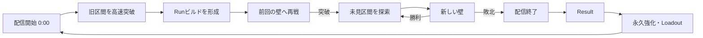
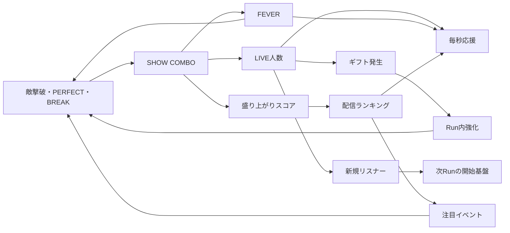

# 『八乙女さきやの ヤニ切れ大パニック！』

## Premium Game Design Bible v0.2

- Status: `CREATIVE DESIGN DRAFT / NOT YET ACCEPTED`
- Product target: `¥9,800級・買い切りプレミアム作品`
- Owner / Final Creative Authority: `さきや`
- Design authority in this draft: `SAKIYA STUDIO`
- Implementation status: `PAUSED UNTIL DESIGN ACCEPTANCE`
- Supersedes: v0.1の「30〜45分／8〜12Run」という短尺仮説のみ。原案のFull Visionは保持する。

---

## 0. この文書の読み方

この文書は完成仕様ではなく、さきや原案を壊さずにプレミアムゲームへ発展させた設計提案である。AIが追加した固有名、数値、物語、装備、カード、プレイ時間は、承認されるまでCanonではない。

| 表記 | 意味 |
| --- | --- |
| `OWNER FIXED` | さきや原案として変更しない核 |
| `STUDIO INTERPRETATION` | 原案から読み取った設計意図。確認が必要 |
| `STUDIO PROPOSAL` | プレミアム品質へ到達するための追加提案 |
| `OPEN` | さきやのCreative Decisionが必要 |

### 0.1 OWNER FIXED — 絶対に守る核

- 一本道の長い世界を、STARTから最右端のFINAL BOSSまで進む。
- 基本循環は `進む → 稼ぐ → 負ける → 永続強化 → STARTから再挑戦 → 前回より遠くへ`。
- 敗北は失敗処理ではなく、次のRunを強くする中心イベント。
- 配信はテーマ装飾ではない。敵撃破、リスナー、LIVE人数、ギフト、コメント、FEVER、ランキング、収益、成長が一本につながる。
- 前に苦戦した敵やボスを、成長後は本当に瞬殺できる。敵側の無断スケーリングでこの快感を消さない。
- `AREA 1 → AREA 2 → AREA 3 → FINAL AREA → FINAL BOSS` と、各AREAのMID BOSS／AREA BOSSを成立させる。
- 主人公の見た目は、添付された八乙女さきやのデザインを基準とし、勝手に改変しない。
- 世界は `pixel art × kawaii × gothic × cyber × streamer`。ピンク、黒、紫、ハート、猫、リボン、LIVE UIを核にし、かわいいが少し不穏。
- Run、Result、Upgrade、Restart、Area Transition、Fever、Save、Endingまで、最初から最後まで破綻なく遊べる。

### 0.2 このゲームにしないもの

- 放置して数字を見るだけのゲーム。
- 高難度アクションの腕前だけで永久成長を無意味にするゲーム。
- 同じ背景と同じ敵の色替えを、数字だけ上げて繰り返すゲーム。
- 配信UIを貼っただけの横スクロールゲーム。
- 敗北のたびに同じ長さの旧エリアを作業として再走させるゲーム。
- ガチャ、広告視聴、スタミナ、期間限定FOMOを前提にした運営型ゲーム。
- 読めないほど情報を出し続ける、安価なスマホ広告風の画面。

---

# Part I — Game Core

## 1. 作品の一文約束

> 前回は止められた場所を、次の配信では数字と歓声ごと踏み潰し、まだ誰も見ていない右側へ到達する。

## 2. プレミアム作品としての価値

`STUDIO PROPOSAL`

¥9,800級の価値は、コンテンツ量だけではなく、次の五つが最後まで一貫することで作る。

1. **触って気持ちいい** — 回避、間合い、BREAK、FEVER発動、オーバーキルに手触りがある。
2. **成長が嘘をつかない** — 強化後は同じ敵の撃破時間、前進速度、演出、配信反応が明確に変わる。
3. **右側が気になる** — 景色、敵、音、物語、収益帯、配信文化が区間ごとに更新される。
4. **Runごとに方針が生まれる** — ただ同じ数値を買い戻すだけでなく、その回の配信ビルドが変わる。
5. **最後に全部が意味を持つ** — FINAL BOSSが、戦闘・ヤニ・配信・FEVER・成長・旅の記憶を統合する。

### 2.1 販売・運用哲学

- 買い切り一本で、STARTからEnding、Postgameまで遊べる。
- 広告、ガチャ、有料スタミナ、ログインボーナス、期間限定強化を入れない。
- Fictional Rankingはオフラインで完結する。サーバー終了でCampaignが遊べなくなる構造にしない。
- 将来追加コンテンツを作る場合も、本編の成長速度を意図的に遅くして購入へ誘導しない。
- Cosmeticを追加する場合、原案の主人公デザインを上書きせず、配信枠、攻撃色、Title Cardなどへ限定する。

### 2.2 想定プレイボリューム

`STUDIO PROPOSAL / BALANCE TARGET`

| 項目 | 目標 |
| --- | --- |
| 初回クリア | 14〜18時間 |
| 標準Run数 | 22〜32Run |
| 序盤の1Run | 6〜10分 |
| 中盤以降の1Run | 12〜22分 |
| FINAL BOSS到達Run | 20〜30分。ただし旧区間は高速圧縮される |
| 本編＋寄り道 | 24〜32時間 |
| クリア後を含む全収集 | 35〜50時間 |

これは尺を引き伸ばす契約ではない。新しい判断、景色、敵、ビルド、物語のいずれも増えない時間は削る。

## 3. Game Core Brief

| 項目 | 設計 |
| --- | --- |
| Genre | Run-based Side-Scrolling Action × Incremental RPG × Streamer Spectacle |
| Player fantasy | 自分の配信とコミュニティを巨大化させ、以前の壁を歓声ごと踏み越える |
| Primary desire | 「もっと右へ行きたい」 |
| Primary verbs | 進む、避ける、撃つ、補給する、盛り上げる、投資する、再挑戦する |
| Core tension | 今の配信を安全に続けるか、ヤニ切れ・高順位・FEVERへ踏み込んで爆発的に伸ばすか |
| Skill / Growth ratio | 同一成長値で腕前が到達距離を約25〜40%変える。数倍〜数十倍の壁は永久成長で越える |
| Failure meaning | 配信終了。結果、学習、資源、次Runの具体的な強さへ変換される |
| Long-term completion | 最右端の王冠をかぶった巨大黒猫FINAL BOSSを撃破し、世界の配信を取り戻す |

### 3.1 代表的な5分間

`STUDIO PROPOSAL`

1. STARTから配信開始。前回苦戦した小型猫を一撃で倒し、前Runとの差が即座に出る。
2. オーバーキルが隣の敵へ貫通し、MOMENTUMが上がって前進速度が加速する。
3. 完璧回避からCOMBOが伸び、LIVE人数が増え、ギフトが飛来する。
4. ヤニを低残量まで引っ張り、危険な`PANIC EDGE`で火力とFEVER獲得を上げる。
5. 安全地帯でヤニ補給するか、そのままELITEへ突っ込むかを判断する。
6. FEVER READY。今すぐ雑魚群へ使うか、30秒先のBOSS BREAKに合わせるか決める。
7. 区間終端で三つの配信企画から一つを選び、そのRunのビルドが形になる。
8. 新しい壁のBOSSへ到達。前回よりHPを大きく削るが敗北し、Resultで差と次の勝ち筋を見る。

---

# Part II — Player Experience

## 4. プレイヤーが毎Run感じる三つの証拠

1. **自分で切り抜けた証拠**
   - 完璧回避、狙ったBREAK、危険なヤニ残量管理、FEVERの重ね方。
2. **強くなった証拠**
   - 前Runの敵が一撃、旧BOSSが数秒、前進が加速、数字の桁が変わる。
3. **先へ進んだ証拠**
   - LAST RUNマーカーを越える、新しい空、新しいBGM、新しい敵、新しいコメント文化。

この三つのうち二つ以上が10分以上起きない状態を、体験上のデッドタイムとみなす。

## 5. 初見からEndingまでの感情曲線

| 時点 | プレイヤーの問い | 体験 | 目標感情 |
| --- | --- | --- | --- |
| 0〜30秒 | 何をするゲーム？ | 右へ進み、敵を倒し、配信数値が一つの撃破から連鎖する | すぐ分かる |
| 1〜3分 | 自分は何を操作する？ | 回避、イケボ、ヤニ補給を一つずつ状況内で学ぶ | 触れる |
| 初FEVER | 何が合流した？ | 戦闘、ギフト、収益、コメント、音楽が同時に上がる | 画面が生きた |
| 初敗北 | 失敗した？ | 前回比較、BOSS残HP、獲得資源、次の変化を即表示 | 次はいける |
| 2〜4Run | 本当に強くなった？ | 序盤敵一撃、旧MID BOSS高速撃破、MOMENTUM加速 | 俺つええ |
| AREA 1突破 | 先は本当に違う？ | 空、建築、音、敵、収益単位がまとめて変わる | 旅が始まった |
| AREA 2 | 何を伸ばす？ | ビルドと永久強化の組み合わせで突破法が分かれる | 自分の攻略 |
| AREA 3 | どこまで壊れる？ | M→B→T、暗い放送塔、配信ノイズ、長い緊張 | 終盤の昂り |
| FINAL AREA | ここまでの全部を使える？ | 全システムが短い周期で要求される | 総決算 |
| FINAL BOSS撃破 | 本当に右端へ来た？ | 進行バーが100%を越え、右側の空間が初めて開く | 長い到達 |
| Ending後 | まだ上を目指せる？ | アンコール、裏ボス、ビルド課題、記録 | 自分で終わりを選べる |

## 6. 最初の30分

`STUDIO PROPOSAL`

### 0〜5分：因果を見せる

- 最初の敵撃破で `ダメージ → 撃破 → リスナー増 → 応援増 → コメント` を一つずつ0.3〜0.7秒差で連鎖表示する。
- チュートリアル文章ではなく、実際に数値と画面が反応することで学ばせる。
- 最初の回避成功で、HPを守るだけでなくCOMBO、LIVE人数、FEVERも守れたことを表示する。

### 5〜12分：最初の壁

- AREA 1 MID BOSSで回避、BREAK、ギフトの優先順位を試す。
- 初RunはMID BOSSを突破し、AREA 1 BOSSで敗北する調整を第一仮説とする。
- 敗北時は「あと何%」と「何が足りなかったか」を、責めずに具体化する。

### 12〜18分：初めての永久強化

- Resultの第一画面は記録、第二画面は永久強化。再スタートボタンは両方から到達可能。
- 購入前から、次Run開始時の具体差をプレビューする。
  - `最初の一撃 18 → 44`
  - `ヤニ補給 2.4秒 → 1.9秒`
  - `開始LIVE人数 120 → 310`

### 18〜30分：前回を踏み越える

- LAST RUNマーカーを世界進行バーと路上のホログラムの両方に表示する。
- 初回に苦戦した敵は一撃または短い連撃で倒れ、旧MID BOSSは演出短縮される。
- 前回の敗北地点を越えた瞬間だけ、BGMに新しいレイヤーと専用コメントを入れる。

## 7. 一回のRunの時間構造



### 7.1 三つの周期

| 周期 | 長さ | 内容 |
| --- | --- | --- |
| Combat Beat | 3〜10秒 | 攻撃予告、回避、撃破、ギフト、数字 |
| Stream Beat | 20〜60秒 | COMBO、LIVE人数、ランキング、FEVER、企画効果 |
| Frontier Beat | 3〜12分 | 旧壁再戦、新景色、新敵、BOSS、敗北または突破 |

通常時に「観察して判断するもの」が8秒以上何もない状態を作らない。ただしAREA移行の4〜6秒は、風景を見るための意図的な余白として使う。

### 7.2 Campaign Growth Roadmap

`STUDIO PROPOSAL / NOT A SCRIPTED GUARANTEE`

| 標準Run帯 | 主な壁 | 新しく理解すること | 直後の圧倒体験 |
| --- | --- | --- | --- |
| 1〜3 | AREA 1 MID／AREA BOSS | 回避、BREAK、ヤニ、最初の永久強化 | START敵の一撃化 |
| 4〜6 | AREA 1 BOSS突破 | 配信企画、FEVER同期、旧BOSS短縮 | AREA 1を高速配信に変える |
| 7〜12 | AREA 2 | Target、危険ギフト、ランキング圧力 | K→M、AREA 1 BOSS数秒化 |
| 13〜20 | AREA 3 | 長期資源、LIVE防衛、Build完成 | AREA 2の敵群を貫通処理 |
| 21〜26 | FINAL AREA | 全システムの高密度統合 | 旧三AREAを一つのOpening Actにする |
| 24〜32 | FINAL BOSS | Phase学習、Loadout最適化、最後の永久成長 | 王冠撃破、100%の右側へ到達 |

プレイヤーの腕前とBuildにより前後する。Run番号で敵を弱くするのではなく、獲得した成長と判断が差を生む。

## 8. 敗北から再スタートまで

### 8.1 戦闘終了

- `GAME OVER`は使わず、`配信終了`とする。
- 0.7秒だけ世界を静止し、最後の攻撃とBOSS残HPを見せる。
- コメントは煽りではなく、「惜しい」「次はいける」「ここ覚えた」へ状態遷移する。
- 2秒以内にResultへ入る。長い敗北演出を毎回見せない。

### 8.2 Resultの情報順

1. **前回との差** — 到達距離、最大DPS、LIVE人数、最高順位。
2. **壁の残り** — BOSS残HP、到達Phase、前回より何秒長く戦えたか。
3. **今回持ち帰るもの** — 永続資源、フォロワー、初回報酬。
4. **次の具体差** — 各強化で開始値や想定撃破時間がどう変わるか。
5. **任意の詳細分析** — 被弾原因、ヤニ切れ時間、ギフト回収率、FEVER効率。

### 8.3 再挑戦速度

- 最短操作では、敗北から30秒以内に永久強化を一つ買い、STARTへ戻れる。
- 深く考えたいプレイヤーは、Build履歴、比較、Loadout、コミュニティ構成を開ける。
- 再スタートは常に画面下部の大ボタンとして残す。強化の全項目確認を強制しない。

---

# Part III — Moment-to-Moment Action

## 9. 推奨操作モデル：Directed Auto-Fire Action

`STUDIO PROPOSAL / OPEN`

通常攻撃は自動照準・自動発射とし、プレイヤーは一画面内の位置、回避、ゲージ、必殺、補給、ターゲット、ビルド判断を握る。

これは放置化ではない。常時連打を削り、危険と好機の判断密度を上げるための構造である。

### 9.1 空間ルール

- 大域的には常に右進行。自由探索や来た道への引き返しはない。
- 通常区間では自動前進し、プレイヤーは画面幅の約35%内で左右に間合いを調整できる。
- 遭遇ロック／BOSS戦では進行が止まり、同じ範囲内で位置取りする。
- 戦闘終了後、カメラが右へ解放される。画面右端には常に次の建築・光・敵影が見える。
- ジャンプは基本操作に入れない。地上／飛行敵の処理は自動照準、ターゲット、回避で扱い、PCとスマートフォンの操作差を抑える。

### 9.2 基本入力

| 行動 | 役割 | 成功の報酬 | 失敗のコスト |
| --- | --- | --- | --- |
| 左右移動 | 間合い、射線、ギフト位置 | 安全地帯、攻撃継続 | 追い詰められる |
| 回避ステップ | 明確な予告攻撃を抜ける | PERFECT、COMBO維持、FEVER、LIVE増 | HP、COMBO、注目度 |
| イケボBURST | 溜めたイケボゲージで範囲火力とBOSS BREAK | 群れ消滅、BREAK、大歓声 | ゲージと撃ちどころ |
| ヤニ補給・長押し | ヤニゲージを回復 | 継続火力、PANIC管理 | 補給中は移動低下・攻撃停止 |
| FEVER発動 | 複数システムを同時加速 | 火力、収益、ギフト、順位 | タイミング機会 |
| ターゲット指定 | 危険敵／装置を優先 | 敵編成を崩す | 別の脅威が残る |
| 配信スキル | Loadout固有の一手 | Buildの個性 | スロットとクールダウン |

### 9.3 通常攻撃

- 前方の最重要脅威へ自動射撃する。脅威度は「接触までの時間」「攻撃準備」「ギフト妨害」「BOSS装置」で決まる。
- プレイヤーのタップ／右スティックで優先対象を上書きできる。
- 火力が敵耐久を大きく上回ると、余剰ダメージが次の敵へ貫通する。成長がテンポへ変換される。
- 低威力のヒット数字は合算し、重要なCRITICAL、BREAK、OVERKILLだけを大きく出す。

## 10. ヤニゲージ — タイトルを遊びへ変える中心システム

`STUDIO PROPOSAL`

ヤニは単なるスタミナではない。残量をどこまで危険側へ寄せるかで、安定・収益・爆発力が変わる。

| 残量 | 状態 | 効果 | 意味 |
| --- | --- | --- | --- |
| 51〜100% | `CALM` | 標準性能。被弾時の安定が高い | 安全な配信 |
| 21〜50% | `BUZZ` | 攻撃速度・ギフト期待値が小上昇 | 少し攻める |
| 1〜20% | `PANIC EDGE` | 火力、FEVER獲得、ランキング点が大上昇。被ダメージと補給中断リスクも上昇 | 意図的な危険運用 |
| 0% | `大パニック` | 短時間の極大火力。HP減少、視覚ノイズ、一定時間後の強制失速 | タイトル通りの非常事態 |

### 10.1 補給

- 補給は長押し。開始から0.4秒で回復を始め、基礎完了時間は2.4秒。
- 補給中は自動攻撃停止、移動速度40%低下。回避でキャンセル可能。
- 被弾すると補給が中断されるが、すでに回復した分は失わない。
- BOSSは必ず補給可能な安全窓を持つ。安全窓は攻撃パターンから学べる。
- 永久強化やRunカードにより、「短く安全に吸う」「低残量を維持する」「大パニックを武器にする」の三方向へ伸ばせる。

### 10.2 支配的最適解を防ぐ契約

- `PANIC EDGE`を維持するだけが常に最強にならないよう、敵タイプとBOSS Phaseで安全性の価値を変える。
- 大パニックは強いが、回復なしで長時間維持できない。
- 低残量Buildには専用投資が必要。未投資状態での無謀な0%維持は到達距離を落とす。
- ヤニ残量を見なくても音、さきやのモーション、画面端の鼓動で状態が分かる。

## 11. イケボ、リスナーの愛、BREAK、COMBO

### イケボゲージ

- 通常Hit、撃破、PERFECT後の反撃で0〜100まで溜まる、さきや本人側の戦闘資源。
- 基礎BURSTは50消費。100時に使うと範囲、BREAK、OVERKILL性能が強化される。
- FEVERが「配信全体の熱」、イケボが「さきや自身の切り札」を担当し、役割を重ねない。
- 永久VOICE BranchとMIC Gearにより、連射型、単発BREAK型、100消費の全画面型へ変化する。
- HUDでは現在量だけでなく、50／100の発動線と次のBOSS BREAKに必要な予測量を示す。

### リスナーの愛

- `リスナーの愛`を主人公のHP／配信継続力として扱い、別の意味が重複するHPバーは置かない。
- リスナーの愛はRun内で継続する。通常敵の小さなミスがBOSSでの余裕に響く。
- 回復はギフト、LOVE系企画、休憩スポット、特定Gearから得る。
- 無敵時間とヒットストップを明確にし、連続被弾で操作不能にならない。
- 0になると死亡ではなく配信終了。永久LOVE Branchで最大値、回復、被弾時のLIVE維持を伸ばす。

### BREAK

- BOSSと大型敵にBREAKゲージを持たせる。
- 通常攻撃で削り、PERFECT回避直後の反撃とイケボBURSTで大きく削る。
- BREAK中はダメージ、ギフト、LIVE増、ランキング点が同時に上がる。戦闘と配信の山場を揃える。

### SHOW COMBO

- 撃破、連続ヒット、PERFECT、ギフト回収で伸びる。
- 被弾で大きく低下し、完全停止時間が続くと緩やかに減る。
- COMBOはダメージそのものより、LIVE増加率とランキング点へ強く影響する。上手さは配信の盛り上がりへ変換される。

## 12. FEVER

- 撃破、PERFECT、BREAK、ギフト、LIVE増加でゲージ上昇。
- 100%で`FEVER READY`。8秒以内は任意発動でき、未発動なら自動発動する。
- 溜め込み続ける最適解を防ぎながら、BOSSのBREAKへ合わせる判断は残す。
- 基礎継続12秒。
- 基礎効果仮説：攻撃×2.0、応援×2.5、ギフト発生×2.0、LIVE増加×3.0、ランキング点×1.8。
- FEVER中のOVERKILLとPERFECTで、最大6秒まで延長できる。
- BGMは専用曲へ切り替えず、現在AREA曲へドラム、歓声、上声、ベースを追加し、場所の記憶を保つ。

---

# Part IV — Streaming as a Game System

## 13. 配信エコロジー



### 13.1 用語の責任分担

| 指標 | 保持 | 増える理由 | ゲームへの効果 |
| --- | --- | --- | --- |
| リスナー／フォロワー | 永続 | 新記録、BOSS、FEVER、初見区間 | 次Runの開始LIVE人数、基礎応援、解放 |
| LIVE人数 | Run内 | 派手な戦闘、COMBO、PERFECT、ギフト | 毎秒応援、ギフト率、コメント密度 |
| 応援 | Run内通貨 | 敵、LIVE人数、ギフト、ランキング | Run内強化購入 |
| ギフト | Run内記録／効果 | LIVE人数、イベント、敵撃破 | 応援、回復、BUFF、FEVER |
| 盛り上がり | Run内評価 | 戦闘の質と配信の継続 | ランキング閾値 |
| ランキング | Run内。最高記録は永続 | 盛り上がり閾値を越える | 応援倍率、注目イベント、次Runの短期ブースト |

リスナーとLIVE人数を同じ数字にしない。永続するコミュニティと、今この瞬間の配信熱量を分ける。

## 14. リスナー／コミュニティ

`STUDIO PROPOSAL`

フォロワー数は永続する「旅のもう一つの距離」。Runで獲得した新規リスナーは失わない。

### 14.1 コミュニティ傾向

プレイスタイルに応じて、リスナー構成が少しずつ変わる。これはBuildを固定する職業ではなく、配信がどう見られてきたかの履歴である。

| 傾向 | 好む行動 | 主な反応 |
| --- | --- | --- |
| バトル勢 | PERFECT、BREAK、BOSS高速撃破 | FEVER、攻撃系ギフト |
| ギフター | ギフト連鎖、長い配信 | 高価値ギフト、回復 |
| 切り抜き民 | OVERKILL、高COMBO、劇的逆転 | 新規LIVE流入、ランキング点 |
| 古参 | 継続Run、惜敗、AREA突破 | 開始LIVE人数、視聴下限 |
| ROM専 | 安定した進行、無理のない配信 | 毎秒応援の安定 |

結果画面では「数が増えた」だけでなく、今回どんな配信として支持されたかを1〜2行で返す。

## 15. ギフト

- ギフトは右側／上空から実物として飛来し、戦場に回収可能な位置を作る。
- 接触回収で100%。取り逃しても60%は自動精算し、操作負荷だけで大損させない。
- 危険位置のギフトは価値が高く、回避や位置取りと判断がぶつかる。
- 種類：応援、回復、FEVER、短期BUFF、ランキング点、特殊企画。
- 大量ギフト時は、同じ数の小箱をばら撒かず、巨大ギフト、軌跡、まとめ数字で価値を読ませる。
- ギフト泥棒を倒すと、奪われたギフトがまとめて戻り、コメントも同期して爆発する。

## 16. コメント

コメントは装飾テキストではなく、ゲーム状態を言語化する第二のフィードバック層。

### 16.1 イベント駆動

- 敵初見、PERFECT、連続被弾、ヤニ低下、ギフト、FEVER、順位変化、BOSS Phase、LAST RUN突破、惜敗、旧BOSS瞬殺に反応する。
- 同じイベントの定型文連打を避け、イベントタグ、感情タグ、リスナー傾向、クールダウンで選ぶ。
- 重要コメントは最大3件。一般コメントは流量だけを背景で表現し、戦闘予告を覆わない。
- ストーリー通信と一般コメントは枠、色、発信元を分ける。
- コメント密度は設定で0〜100%。重要な攻略反応だけ残すモードを用意する。

### 16.2 反応の例

| 状態 | コメント方向 |
| --- | --- |
| 初めてPERFECT | 「今の避けた！」「うま」 |
| PANIC EDGE突入 | 「ヤニないぞ！？」「そのまま行く気？」 |
| 旧BOSS瞬殺 | 「前ここで終わったよね？」「成長えぐい」 |
| LAST RUN突破 | 「新記録！」「右の景色初めて見た」 |
| BOSS残り10% | 「いける」「補給窓くるよ」 |
| 敗北 | 「惜しい」「次はBREAK合わせよう」 |

## 17. 配信ランキング

- 実在プレイヤーとのオンライン順位ではなく、世界内の配信ランキングを基本とする。オフラインで完結し、サービス終了で価値を失わない。
- 順位はリスナー総数だけでなく、BOSS、COMBO、PERFECT、FEVER成果、継続LIVE人数から算出する。
- 次順位までの必要盛り上がりを常時小さく表示し、ランダムに見せない。

| 順位帯 | 応援倍率 | 追加効果 |
| --- | --- | --- |
| #50〜31 | ×1.0 | 基準 |
| #30〜21 | ×1.3 | ギフト抽選+ |
| #20〜11 | ×1.5 | FEVER獲得+ |
| #10〜4 | ×1.8 | 高価値ギフト、注目イベント |
| #3 | ×2.0 | ELITE配信乱入、報酬大 |
| #2 | ×2.2 | Crown Watcher出現 |
| #1 | ×2.5 | 専用コメント、最高注目報酬 |

### 17.1 高順位のリスク

高順位はただの複利BUFFにしない。TOP10以降は、報酬が大きい代わりに「注目イベント」が明示的に発生する。

- 画面に`TOP10 注目襲来`と予告してELITEや特殊ギフトを出す。
- 難化は必ず予告し、通常敵のHPを裏で上げない。
- 注目イベントを突破できなくても順位そのものを全没収しない。

### 17.2 次Runボーナス

原案の「ランキングが次Runへつながる」を、永久倍率の雪だるまではなくOpening Boostとして実装する。

| 前Run最高順位 | 次Run開始90秒の効果 |
| --- | --- |
| #50〜31 | なし |
| #30〜21 | 開始LIVE人数×1.10、最初のギフト品質+1 |
| #20〜11 | 開始LIVE人数×1.20、LIVE増加×1.10 |
| #10〜4 | 開始LIVE人数×1.35、LIVE増加×1.15 |
| #3〜2 | 開始LIVE人数×1.50、最初の注目イベント報酬×1.25 |
| #1 | 開始LIVE人数×1.75、90秒間の応援×1.20、専用Opening |

- 90秒後は通常倍率へ滑らかに戻る。
- 効果は旧区間の立ち上がりを高速化するが、新しいBOSSを自動突破するほど強くしない。
- 過去最高順位ではなく直前Runの順位を使い、毎回の配信成果を次回へ渡す。過去最高は記録と解放に使う。

---

# Part V — Growth and Economy

## 18. リセットされるもの／残るもの

| 状態 | Run終了時 | 設計理由 |
| --- | --- | --- |
| 応援 | リセット | Run内の加速を毎回組み立てる |
| Run内Lv | リセット | 旧道の再攻略に選択を作る |
| 配信企画カード | リセット | 毎RunのBuildを変える |
| LIVE人数 | リセット | 配信の立ち上がりを作る |
| ギフト／FEVER／COMBO／現在順位 | リセット | 一回の盛り上がりを閉じる |
| リスナー／フォロワー | 保持 | 旅とコミュニティの積み上がり |
| 永続資源「配信メモリー」仮 | 保持 | 明示的な永久強化へ使う |
| Channel Board | 保持 | 次Runの開始性能を変える |
| BOSSエンブレム／配信ギア | 保持 | 新しいBuildと操作を解放する |
| AREA解放、記録、最高値 | 保持 | 冒険の履歴 |
| FINAL BOSS撃破／Ending | 保持 | 完了状態とPostgame |

## 19. Run内成長：二層構造

### 19.1 即時レベルアップ

応援を使い、戦闘を止めずに四軸を上げる。

| 軸 | 数値効果 | 体感効果 |
| --- | --- | --- |
| イケボ | 通常攻撃、BURST、BREAK | 数字、貫通、撃破音、吹き飛び |
| ヤニ吸引力 | 攻撃速度、容量、補給効率 | 攻撃密度、止まらず進む時間 |
| リスナーの愛 | HP、回復、LIVE維持 | 生存、歓声、開始基盤 |
| ギフトボーナス | 敵収益、毎秒応援、ギフト価値 | 購入周期、箱の大きさ、収益桁 |

- ボタンには現在値、次値、価格、購入後の主要差を表示する。
- 長押しで複数購入。BOSS直前は購入予測を一度だけ知らせる。
- 自動購入はアクセシビリティ／周回補助として用意するが、手動最適化より少し保守的にする。

### 19.2 配信企画カード

`STUDIO PROPOSAL`

区間終端、ELITE、MID BOSS報酬で三択から一つを選ぶ。数値Lvだけでは作れない、そのRun固有のルール変化を担当する。

#### Buildタグ

- `VOICE` — 貫通、BURST、BREAK。
- `PANIC` — 低ヤニ、大パニック、リスク火力。
- `FEVER` — 獲得、延長、連鎖。
- `GIFT` — 回収、ジャックポット、ギフト攻撃化。
- `LOVE` — HP、回復、LIVE維持。
- `RANK` — 高順位、注目イベント、報酬。

#### 代表Build

| Build | 中心判断 | 代表効果 |
| --- | --- | --- |
| PANIC OVERDRIVE | 低ヤニを維持し、補給窓だけ守る | PANIC中の貫通、補給完了シールド |
| GIFT HURRICANE | 危険なギフトを拾い連鎖させる | ギフトが周回弾、回収でFEVER延長 |
| NEVER ENDING FEVER | BREAKとOVERKILLをFEVERへ集約 | 延長上限上昇、FEVER終了爆発 |
| LOVE STREAM | LIVE人数を落とさず安定攻略 | 視聴下限、回復、応援の安定 |
| RANK HUNTER | 注目イベントを自ら呼び込む | ELITE報酬、順位倍率、危険増加 |
| BOSS BREAKER | PERFECT後のBURSTへ集中 | BREAK倍率、Phase短縮、BOSSギフト |

#### ランダム疲れ対策

- 三択のうち最低一枚は現在の上位二タグと噛み合う。
- 各AREA一回の無料リロール。
- 解放カードが増えても、弱いカードで抽選が薄まらない重み付け。
- カードは拾っただけで強いのではなく、プレイの判断を少なくとも一つ変える。
- 同じRunで成立しない効果は出さない。

## 20. 永久成長：Channel Board

`STUDIO PROPOSAL`

小さな+5%を延々買うのではなく、序盤は大きな倍率、節目は挙動変化、終盤はBuild解放を与える。

| Branch | 原案との対応 | 主な永久効果 | 節目の挙動変化例 |
| --- | --- | --- | --- |
| VOICE | イケボ強化 | 攻撃、BURST、BREAK | OVERKILL貫通、BURST二段化 |
| SMOKE | ヤニ吸引力 | 容量、補給、PANIC効率 | 移動補給、0%猶予、煙バリア |
| LOVE | リスナー定着率 | HP、回復、開始LIVE | 被弾時COMBO保護、古参救援 |
| GIFT | ギフト倍率 | 価値、出現、回収 | ギフト選択、ジャックポット |
| FEVER | FEVER効率／倍率 | 獲得、時間、倍率 | 手動終了爆発、連続FEVER |
| SPOTLIGHT | ランキング／支援金 | 順位報酬、開始応援 | 注目イベント選択、開始ブースト |

### 20.1 Boardの規模仮説

- 6 Branch × 7主要Nodeを基準とし、合計42主要Node。
- 1Branchにつき二回、相互排他的な節目選択を置く。リスペックはResultで無料。
- 最初から全Branchを見せるが、未解放部は名前と役割だけを見せ、詳細情報を圧縮する。
- AREA 1突破でFEVER、AREA 2突破でSPOTLIGHTの深部を解放する。

## 21. 配信ギア

`STUDIO PROPOSAL`

ランダムレア度の装備掘りではなく、BOSS、寄り道課題、Postgameで獲得する固定性能の手作りSidegrade。

| Slot | 役割例 |
| --- | --- |
| MIC | 通常攻撃／BURSTの形式を変える |
| LIGHTER | ヤニ補給／PANICのルールを変える |
| GLASSES | ターゲット、予告、CRITICALを変える |
| CHARM | ギフト、LOVE、FEVERを変える |

- 本編16点を基準とする。
- 外見は主人公デザインを変更せず、攻撃色、アイコン、短いVFXで差を出す。
- 強さの縦更新ではなく、Buildの横展開。上位レアへ乗り換えるだけにしない。

## 22. 永続資源と報酬式

永続通貨の正式名は`OPEN`。本文では仮に`配信メモリー`とする。

### 22.1 獲得元

- 最高到達距離。
- 新しい区間への初到達。
- BOSSへ与えたHP割合と到達Phase。
- 最高ランキング。
- 新規リスナー。
- 初回BOSS撃破、AREA突破、チャレンジ。

### 22.2 敗北保証

- 前回記録付近まで到達したRunは、最低一つの意味ある永久強化を買える量を保証する。
- BOSSへ与えたダメージを資源へ変え、「削ったのに何も残らない」をなくす。
- 同じ壁で3Run停滞した場合、敵を秘密裏に弱くせず、次のいずれかを明示解放する。
  - 弱点を学べる短いリハーサル課題。
  - そのBOSSに有効な配信ギア取得ルート。
  - 永久Boardの対策Node。
- 報酬は前線ほど大きくし、序盤だけを安全に周回する方が最適にならない。

### 22.3 Run収入の構成比

`BALANCE TARGET`

| 収入源 | 標準構成比 | 役割 |
| --- | --- | --- |
| 敵撃破 | 35〜50% | 戦闘を止めない中心収入 |
| LIVE人数による毎秒応援 | 20〜30% | 配信を盛り上げ続ける価値 |
| ギフト | 15〜25% | 位置取りとイベントの瞬間報酬 |
| BOSS／初見／注目イベント | 10〜20% | 壁突破と危険選択の大報酬 |

どれか一つが70%以上を占めるBuildは、他の遊びを無意味にしていないか検証する。

### 22.4 経済式の設計形

実数はSimulationで確定するが、責任は次のように分ける。

```text
毎秒応援 = AREA基礎値 × LIVE人数の緩やかな指数 × ランキング倍率 × Build補正
敵応援   = 敵基礎値 × COMBO品質 × OVERKILL補正 × ランキング倍率
新規リスナー = 新規LIVE流入 × 配信品質 × 初見／BOSS係数
配信メモリー = 到達Tier + BOSS進捗 + 新記録 + 初回報酬
```

- LIVE人数は極端な複利を避けるため、毎秒応援へは0.6〜0.8乗相当の緩やかな指数で接続する。
- AREA基礎値が桁の更新、ランキングとBuildが同じAREA内の差を担当する。
- COMBOは敵HPを直接大きく変えず、収益と視聴流入を介して少し遅れて火力へ戻る。
- 永続資源はRun収入と別式にし、応援Buildだけが永久成長まで独占しない。

## 23. 数値曲線

`BALANCE HYPOTHESIS`

### 23.1 原則

- 序盤ダメージは10〜100。終盤はT、Qa以上まで到達可能。
- K→M→B→T→Qa→Qiを段階的に解放し、序盤から巨大表記を使い切らない。
- 新区間の最初の敵は直前区間の雑魚より約3〜8倍強い。
- AREA境界は要求DPSと収益帯を約30〜100倍跳ね上げ、世界が変わった感覚を作る。
- 永久強化の序盤主要Lvは×1.6〜2.2。後半は×1.2〜1.5と挙動Nodeへ比重を移す。
- Run内Lvは×1.20〜1.35。価格は×1.45〜1.65。

### 23.2 撃破時間の契約

| 状態 | 通常敵TTK | BOSS戦 |
| --- | --- | --- |
| 新区間へ初到達 | 1.5〜4秒 | 90〜210秒で敗北または辛勝 |
| 一回強化後の再戦 | 0.7〜2秒 | 前回の半分以下の残HPを目標 |
| AREA一つ先へ到達後 | 0.1〜0.5秒 | 8〜20秒 |
| AREA二つ先へ到達後 | 一撃＋貫通 | 2〜6秒、演出短縮 |

### 23.3 腕前と成長の境界

- 同じBuild／永久強化なら、上手い回避とゲージ管理で到達距離が25〜40%伸びる。
- ただし次AREAの桁差を腕前だけで越えられない。
- 逆に十分な成長があってもFINAL BOSSは完全放置では倒せない。

## 24. 旧エリア高速化：MOMENTUM

過去の壁を毎回同じ尺で再生しない。強さを進行速度へ直接変換する。

- 敵を0.5秒以内に倒す、OVERKILLする、無被弾で抜けるとMOMENTUMが上昇。
- 前進速度は最大5倍。敵出現間隔も詰まり、貫通攻撃でまとめて処理できる。
- 被弾で一段低下。新規区間と未撃破BOSSでは上限を抑え、初見を飛ばさない。
- 旧BOSSの予測撃破時間が3秒未満なら、`INSTANT HIGHLIGHT`演出で走り抜けながら撃破する。
- 二つ先のAREAへ到達した時点で、最初のAREAは初見時間の20%以下に圧縮する。
- STARTから始める原則は崩さず、成長によって旅の速度そのものを変える。

---

# Part VI — World, Story, and Levels

## 25. 世界法則

`STUDIO PROPOSAL`

この街では配信信号が電力、広告、ネオン、交通、そして人々の感情まで循環させている。遠く右側の巨大放送塔から流れる異常な信号が、街のLIVEを吸い上げ、配信を一つの王冠へ集約し始めた。

さきやは配信を止められるたびにSTARTへ戻るが、配信アーカイブとリスナーの記憶は残る。世界が一晩ごとに配信ルートを再構成するため、Runの再開が物語上も成立する。

### 25.1 中心テーマ

> 数字に見られるための配信と、誰かとつながるための配信は同じなのか。

このテーマを説教にしない。数字の巨大化は最後まで気持ちよく、リスナーの愛も本物として扱う。敵は「人気になること」ではなく、配信者とリスナーの関係を一方向へ吸い上げる仕組みである。

### 25.2 主人公と白いウサギ

- 八乙女さきやは原案ビジュアルを固定。受け身の被害者ではなく、自分から右側へ配信しに行く。
- 白いウサギは`STUDIO PROPOSAL`として、同行マスコット兼配信モニター役。チュートリアル、Result、過去Runの記憶を自然に伝える。
- ウサギの名前、口調、物語上の正体は`OPEN`。

## 26. ワールド全景

```text
START
  └─ AREA 1: STREAMER CITY
       ├─ District 1
       ├─ District 2
       ├─ MID BOSS
       ├─ District 3
       ├─ District 4
       └─ AREA BOSS
            └─ AREA 2: NEON OVERPASS
                 ├─ District 5
                 ├─ District 6
                 ├─ MID BOSS
                 ├─ District 7
                 ├─ District 8
                 └─ AREA BOSS
                      └─ AREA 3: DARK BROADCAST TOWER
                           ├─ District 9
                           ├─ District 10
                           ├─ MID BOSS
                           ├─ District 11
                           ├─ District 12
                           └─ AREA BOSS
                                └─ FINAL AREA: LIVE FORTRESS
                                     ├─ District 13
                                     ├─ District 14
                                     ├─ District 15
                                     ├─ District 16
                                     └─ FINAL BOSS
```

District名はすべて仮称。各大AREAを二枚の背景で済ませず、空、遠景、中景、路面、群衆、看板、敵、音を段階的に更新する。

## 27. AREA 1 — STREAMER CITY

### 体験役割

- かわいさ、速さ、配信の因果を理解させる。
- 最初は大量の弱敵を倒せるが、BOSSで初めて「成長が必要」と分からせる。
- ピンクを最大彩度で使い切らず、AREA 2以降の色変化を残す。

| District仮称 | 景色 | 遊び | 新しい脅威 |
| --- | --- | --- | --- |
| 1. START ALLEY | 朝焼け、個人配信看板、小さなネオン | 移動、通常攻撃、最初のギフト | 小型猫、飛行猫 |
| 2. RIBBON MARKET | リボン屋台、ペンライト、近い観客 | 敵群、COMBO、LIVE人数 | 突進猫、ギフト泥棒 |
| MID BOSS GATE | 小型ライブステージ | 回避、BREAK、奪還ギフト | AREA 1 MID BOSS |
| 3. LIVE PLAZA | 巨大モニター、ハート広告、観客密度上昇 | FEVER、ターゲット優先 | 遠距離妨害、盾敵 |
| 4. BROADCAST GATE | 夜へ移る空、閉じた放送門 | 長い敵編成、補給窓 | 大型猫、妨害装置 |
| AREA BOSS | 閉鎖されたLIVEゲート | 全基礎の試験 | AREA 1 BOSS |

### AREA移行

BOSS撃破でゲートの巨大画面が割れ、その向こうを走る高架線と繁華街が見える。カットシーンで切らず、前進しながら空の色、テンポ、収益単位が切り替わる。

## 28. AREA 2 — NEON OVERPASS / ARCADE CITY

### 体験役割

- 密度、速度、広告、ランキング競争を遊びへする。
- 画面上下から攻撃が来るが、予告の読みやすさは保つ。
- K〜M帯へ入り、Run内購入頻度とBuild形成が加速する。

| District仮称 | 景色 | 遊び | 新しい脅威 |
| --- | --- | --- | --- |
| 5. ARCADE ROOFLINE | ゲームセンター屋上、高架線 | 高低差の射線、飛行優先 | 狙撃ドローン、広告砲台 |
| 6. BILLBOARD CANYON | 巨大モニター峡谷、密集看板 | 予告を背景看板でも伝える | 模倣敵、画面妨害 |
| MID BOSS GATE | 走行中の高架ライブ | ターゲット、装置破壊 | AREA 2 MID BOSS |
| 7. GIFT EXCHANGE | 商店街、配送レール、ギフト倉庫 | 危険ギフト、経済Build | ギフト徴収敵、硬い敵 |
| 8. RANKING INTERCHANGE | 無数の順位表示、分岐する高架 | TOP10注目イベント | ELITE、突進列車 |
| AREA BOSS | 巨大ランキングアリーナ | 順位圧力とBREAK | AREA 2 BOSS |

### AREA移行

ランキングアリーナの最上段から街を見下ろすと、遠方の空を貫く放送塔が初めて全景で現れる。ネオンの一部が消え、BGMから高域が抜け、ノイズが混ざる。

## 29. AREA 3 — DARK BROADCAST TOWER DISTRICT

### 体験役割

- 世界の不穏さと資源圧力を最大化する。
- ヤニ補給、安全窓、LIVE人数維持、長いBOSS判断を試す。
- 旧エリアの高速突破との対比で、未見区間の重さを強く感じさせる。

| District仮称 | 景色 | 遊び | 新しい脅威 |
| --- | --- | --- | --- |
| 9. BLACKOUT WARD | 消えた看板、雨、黒い商店街 | 視覚ノイズ下の明瞭な予告 | 静電霊、LIVE吸収敵 |
| 10. ANTENNA FOREST | 巨大アンテナ群、雷、深い遠景 | 射線切替、補給場所選び | アンテナ槍、追尾電波 |
| MID BOSS GATE | 壊れた中継ステージ | LIVE維持、装置優先 | AREA 3 MID BOSS |
| 11. COLLAPSED TOWERLINE | 崩れた高層街、落下看板 | 連続遭遇、長期資源管理 | PANIC狩り、鏡配信敵 |
| 12. HEARTLESS RELAY | 黒×ピンクの巨大中継核 | AREA総合試験 | 塔の番人、FEVER妨害 |
| AREA BOSS | 放送塔基部 | ヤニ、BREAK、暗転、長期戦 | AREA 3 BOSS |

### AREA移行

塔基部の扉が開くと、暗い空の上に巨大なライブ会場の白い光が漏れる。世界が終わるのではなく、観客の声が遠くから戻り、FINAL AREAへの期待へ反転する。

## 30. FINAL AREA — LIVE FORTRESS

### 体験役割

- それまでの世界の視覚、音、敵、配信システムを、単なる再利用ではなく新しい組み合わせで再提示する。
- 新規チュートリアルは増やさず、プレイヤーが身につけた判断を高密度で組み合わせる。
- 最右端が近いことを、背景の巨大ハート装置が徐々に画面中央へ近づくことで伝える。

| District仮称 | 景色 | 遊び |
| --- | --- | --- |
| 13. AUDIENCE CAUSEWAY | 無数の観客、三AREAの看板残骸 | 敵ミックス、コミュニティ救援 |
| 14. INFINITE STAGE | 複数ライブステージ、移動照明 | 注目イベント連続、Build完成 |
| 15. HEART ENGINE | 巨大ハート装置、配信回路 | 装置と敵の同時処理、BOSS準備 |
| 16. CROWN CHAMBER | 巨大モニター、王冠、最右端の闇 | 静かな前室、全記録の提示 |
| FINAL BOSS | 王冠をかぶった巨大黒猫 | 全システムの総決算 |

## 31. レベル進行のリズム

- 通常Encounter: 20〜45秒。
- ELITE／注目イベント: 45〜90秒。
- District初見: 5〜10分。
- MID BOSS: 90〜180秒。
- AREA BOSS初見: 120〜240秒。火力不足時は明確な放送終了予告へ移る。
- 区間ごとに「敵群 → ギフト波 → 静かな補給窓 → ELITE／選択」の強弱を作る。
- 休憩スポットは会話、強化、回復のうち二つだけを短く行い、Hub化して進行を止めない。
- 新しい敵は単体で教えてから、既存敵との組み合わせで試す。

---

# Part VII — Enemies and Bosses

## 32. 敵アーキタイプ

`CONTENT TARGET: 24 core archetypes + variants`

| 役割 | 読み取るもの | 代表挙動 |
| --- | --- | --- |
| 小型猫 | 火力とテンポ | 群れ、短い接触攻撃 |
| 飛行猫 | 自動照準と優先度 | 上空射撃、ギフト遮断 |
| 突進敵 | 距離と回避 | 直線予告、壁際圧力 |
| 遠距離敵 | ターゲット判断 | 射線、狙撃予告 |
| 盾敵 | BREAKと側面時間 | 正面軽減、構え解除 |
| 大型敵 | 補給窓と継続火力 | 遅い大技、雑魚生成 |
| ギフト泥棒 | 経済防衛 | ギフト奪取、逃走 |
| FEVER妨害 | 盛り上がり防衛 | ゲージ封印予告 |
| LIVE吸収 | 配信維持 | 視聴者を吸う中継線 |
| PANIC狩り | ヤニ判断 | 低残量時に攻撃変化 |
| 模倣敵 | Build理解 | 直前の攻撃形式をコピー |
| 装置敵 | 敵群の優先順位 | 他敵BUFF、画面ギミック |

各AREAに6つの新アーキタイプを導入し、前AREAの敵を新しい編成で再利用する。単なるHP増加だけの色違いは「変種」ではなく、最低一つの読みと対処を変える。

## 33. 攻撃予告の文法

- 突進：進行方向の太い矢印＋地面の震え。
- 遠距離：射線＋発射までの収束円。
- 地面攻撃：床のパターン＋影。
- 捕獲／吸収：対象と敵を結ぶ線。
- 画面全体攻撃：BOSSモーション、音、外周ゲージの三重予告。
- 色だけに依存せず、形、動き、音を併用する。
- 同時に重大予告を出す上限を設け、難しさを不可読性で作らない。

## 34. Main Boss Plan

固有名はすべて仮称。機能と体験を先に固定する。

### 34.1 AREA 1 MID BOSS — Gift-Eater Mascot（仮）

- 教えるもの：PERFECT回避、イケボBREAK、ギフト奪還。
- 攻撃：大きな跳びかかり、ハート地雷、ギフト吸い込み。
- 吸い込まれたギフトは腹部シールドになる。BREAKするとすべて戻る。
- 初撃破報酬：最初の配信企画カード選択、GIFT Branchの節目。

### 34.2 AREA 1 BOSS — Broadcast Jam Cat（仮）

- 役割：基礎システムを一つのBOSS戦へまとめ、初めての永久成長壁になる。
- Phase 1：パウスラム、ノイズ弾、明瞭な補給窓。
- Phase 2：二つの妨害装置を出し、ターゲット優先を要求。
- Phase 3：短い高速パターン。FEVERとBREAKを合わせれば大幅短縮。
- 敗北時に、攻撃力不足、BREAK不足、被弾、補給失敗のどれが主因かを表示できる。

### 34.3 AREA 2 MID BOSS — Rail Panther（仮）

- 教えるもの：背景予告、複数ターゲット、移動する弱点。
- 高架レールと巨大看板を行き来し、看板に次の攻撃予告が映る。
- 支持装置を壊すと地上へ落下し、短いBREAK窓が開く。

### 34.4 AREA 2 BOSS — Ranking Devourer（仮）

- 役割：高順位の報酬と危険を一つの戦闘で試す。
- Phase 1：広告レーザー、コピー配信者、順位ゲート。
- Phase 2：現在のランキング倍率を一時ロックするが、PERFECTと装置破壊で即時奪還できる。
- Phase 3：TOP10注目イベントを連続化。成功するほどBOSSへのギフト砲撃が増える。
- 永続成長を没収せず、「配信中の倍率を取り返す」戦いにする。

### 34.5 AREA 3 MID BOSS — Dead Air DJ（仮）

- 教えるもの：LIVE人数の防衛、送信装置、長いヤニ管理。
- 三つの中継器からLIVE吸収波を出す。すべて同時破壊ではなく、優先順位を選ぶ。
- 音楽のStemが敵装置に奪われ、壊すたびに戻る。状態を耳でも理解できる。

### 34.6 AREA 3 BOSS — Tower Custodian（仮）

- 役割：FINAL前の総合試験。特にヤニ補給窓と長期戦。
- Phase 1：アンテナ腕、追尾電波、補給可能な明確な静止窓。
- Phase 2：黒い雷がFEVER獲得を一時阻害。PERFECTで逆に大きく回復。
- Phase 3：背景を暗転させるが、HP、ヤニ、予告輪郭は必ず残す。Reduced Darkness設定あり。
- 撃破で放送塔ではなく、その上に隠れていたLIVE要塞が姿を現す。

## 35. FINAL BOSS — Crowned Black Cat

`OWNER FIXED: 王冠をかぶった巨大黒猫系ボス`

### 35.1 体験契約

- 圧倒的なHPを持ち、初めて到達したRunで倒せる前提にしない。
- ただし単なるHP袋にしない。初到達でもPhase、攻撃、弱点を学び、次Runで明確に前進できる。
- 永久成長が不足していれば長期戦で押し切られる。十分な成長があれば、操作成功が最後の一押しになる。

### 35.2 四Phase案

#### Phase 1 — THE CROWN WATCHES

- 巨大な前脚、王冠衛星、観客壁。
- AREA 1で学んだ大きな予告とGift-Eaterの奪還構造を発展。
- BOSSの大きさと最右端の距離を見せる。

#### Phase 2 — RANKING ECLIPSE

- 王冠が配信ランキングを吸い上げ、注目イベントを連続生成する。
- AREA 2の要素を再利用するが、順位を守るだけでなく、ELITE撃破が王冠への攻撃になる。
- 最初の到達Runはここで敗北する想定を第一仮説とする。

#### Phase 3 — HEART ENGINE

- 胸部の巨大ハート装置が露出。送信器、雷、ヤニ吸収波が連動する。
- AREA 3の補給窓、LIVE防衛、装置優先を統合。
- 三つの弱点を壊す順番で安全性、収益、BREAK時間が変わる。

#### Phase 4 — LAST BROADCAST

- BOSSが最右端へ退き、崩れるステージを右へ追う短いチェイス戦へ移る。
- MOMENTUM、FEVER、ギフト、コミュニティ反応が最大化する。
- 残り10%で全リスナー傾向から支援が来るが、自動勝利にはしない。
- 最後の一撃後、進行バーの100%位置を越えてプレイヤーアイコンが右へ進む。

### 35.3 初到達から撃破まで

- 初到達：Phase 1突破〜Phase 2中盤で敗北。
- 1〜2回の永久強化後：Phase 3へ到達。
- Build理解と追加強化後：Phase 4へ。
- 最終撃破：3〜6回のFINAL BOSS挑戦を目安とする。
- Resultでは残HPだけでなく、Phase、BREAK回数、最も危険だった攻撃、次の対策を表示する。

## 36. BOSS品質基準

- すべての大攻撃は初見でも反応可能、二回目で学習可能。
- 各BOSSに最低一つ、配信システムと直接つながる固有ルールを持たせる。
- 各BOSSを少なくとも三つのBuildで攻略可能にする。
- 火力不足時はただ長引かせず、配信終了までの圧力を段階的に伝える。
- 既撃破BOSSは導入短縮可能。十分に成長すれば瞬殺を許す。
- BOSSのギミックがHUDを偽装したり、重要数値を読めなくしたりしない。

---

# Part VIII — Interface and Controls

## 37. 画面構成

| Screen | 目的 | 主な行動 |
| --- | --- | --- |
| Title / Continue | 再開、New Game、設定 | Continueを最優先 |
| Studio | Loadout、記録、任意の物語 | 配信開始。滞在強制なし |
| RUN | 戦闘、成長、配信運用 | 進む、避ける、発動、購入 |
| Pause | 状態確認、操作、設定 | 即時復帰、Run中断保存 |
| RUN RESULT | 差、壁、獲得を理解 | 詳細確認、強化へ |
| UPGRADE | 永久成長、Build準備 | 購入、リスペック、再スタート |
| Archive | 敵、BOSS、コメント、記録 | 収集と世界理解 |
| Ending / Encore | 勝利の余韻、Postgame | アンコール解放 |

## 38. RUN HUDの優先順位

1. **生存と危険** — さきや、HP、ヤニ、攻撃予告。
2. **BOSS状態** — HP、BREAK、Phase、終了圧力。
3. **今使える力** — 回避、イケボ、FEVER、配信スキル。
4. **右への距離** — NEXT GOAL、進行バー、LAST RUNマーカー。
5. **配信の反応** — LIVE人数、COMBO、コメント、ギフト。
6. **成長判断** — 応援、毎秒収益、Run内強化、ランキング。

情報はすべて同じ強さで光らせない。通常、危険、好機、クライマックスの四段階で視覚優先度を切り替える。

### 38.1 推奨レイアウト

#### PC / 16:9

- 上：ロゴ縮小版、HP／ヤニ／愛、LIVE人数、主要通貨。
- 左：コメント。戦場の予告領域へ侵入しない固定Rail。
- 中央：世界描画。キャラクターは画面左寄り35〜42%。
- 中央上：FEVER、BOSS HP、COMBO。
- 下：進行マップ、NEXT GOAL、Run内強化、スキル。

#### Smartphone / 9:16

- 添付リファレンスの縦長情報密度を基準とする。
- 上25%：配信ステータス。
- 中央40〜45%：戦場。コメントは左端の透過Rail。
- 下30〜35%：進行、強化、タッチ操作。
- PC画面を縮小するのではなく、同じ優先順位を縦へ再構成する。

## 39. 進行バー

- STARTからFINAL BOSSまで一本の長い線。
- 未到達区間は輪郭と遠いランドマークだけ見せる。完全に隠して期待を消さない。
- プレイヤー、MID BOSS、AREA BOSS、LAST RUN、BEST RUNを別形状で表示。
- BOSS戦中は現在アイコンが壁へ押し付けられ、撃破で右側の線が点灯する。
- 旧AREA高速突破時は、アイコンの移動速度そのものが上がる。

## 40. RESULT / UPGRADE UX

### Result Hero

- `AREA 2 / RANKING INTERCHANGEで配信終了`
- `BOSS HP 残り28%`
- `BESTより +7.4%前進`
- `新規リスナー +312,845`

### 比較

- 前Runと今回の二本バー。
- 最大ダメージ、旧BOSS撃破時間、FEVER回数、到達距離は差分を強調。
- 負けた原因は最大三つ。精密な戦闘ログは任意詳細へ。

### Upgrade Preview

- 数値だけでなく、代表敵の予測撃破時間を表示。
- 例：`小型猫 0.8秒 → 0.3秒`、`AREA BOSS予測 84秒 → 47秒`。
- 推奨は一つに断定せず、`火力で短縮`、`補給を安全化`、`収益を先行`のように目的を示す。

## 41. 入力案

`OPEN / PLAYTEST REQUIRED`

| Action | Keyboard | Controller | Touch |
| --- | --- | --- | --- |
| 移動 | A / D | Left Stick | 左側Drag |
| 回避 | Space | B / R1 | 右下大ボタン |
| イケボ | J | X | 右側ボタン |
| ヤニ補給 | K長押し | Y長押し | 独立長押し |
| FEVER | L | R2 | READY時拡大ボタン |
| 配信スキル | U / I | A / L2 | 右側サブボタン |
| ターゲット | Q / E、Click | Right Stick | 敵Tap |
| Run内強化 | 1〜4 | D-pad | 下部Card |

- 全入力をリマップ可能。
- 連打を必須にしない。
- 片手Touch、左利きTouch、ボタンサイズ調整を用意する。
- フォーカス喪失、着信、タブ切替で自動Pause。

## 42. フィードバック設計

| 事象 | 即時 | 1秒以内 | 長期証拠 |
| --- | --- | --- | --- |
| 敵撃破 | ヒットストップ、消滅、数字 | コメント、LIVE、応援 | Result撃破数、フォロワー |
| PERFECT | 輪郭光、専用音 | FEVER、COMBO、コメント | 回避率、Build条件 |
| 永久強化 | Preview、購入音 | 次Run開始値 | 旧敵TTK、MOMENTUM |
| AREA突破 | BOSS崩壊、右開放 | 背景／BGM／単位変更 | Map点灯、Archive |
| FEVER | 画面枠、音Stem、攻撃変化 | ギフト／コメント波 | FEVER Build、最高記録 |

---

# Part IX — Visual and Audio Direction

## 43. Visual North Star

> 高密度なのに、今避けるものと今気持ちいいものが一目で分かる、黒い夜に咲くピンクの配信世界。

### 43.1 アート原則

- Hi-bit pixel art。細密だが、シルエットと攻撃予告を装飾より優先する。
- さきやはピンク髪、眼鏡、猫耳アクセサリー、ゴシックkawaii衣装、白ウサギ、ピンク×黒を固定。
- 主人公は背景より明るい輪郭と髪色で常時識別する。
- 通常敵は一目で行動役割が分かる輪郭。BOSSは黒い大質量とハート／王冠の一記号で記憶させる。
- ネオン発光を全要素へ均等にかけない。発光はインタラクティブ、危険、報酬、LIVE状態へ意味を持たせる。
- ハート、猫、リボンを無差別に飾らず、AREAとシステムごとに責任を割り当てる。

### 43.2 色の役割

| 色 | 主責任 |
| --- | --- |
| Neon Pink | さきや、味方攻撃、LIVEの生命 |
| Magenta Red | PANIC、危険、強い攻撃 |
| Lavender | FEVER、BREAK、特殊状態 |
| Cyan | AREA 2の都市機構、遠距離予告 |
| Warm Gold | ギフト、応援、OVERKILL、初回報酬 |
| Ink Black | 敵質量、世界の不穏、余白 |
| Soft White | 読むべき文字、最重要瞬間 |

色覚差に備え、危険・味方・報酬は形と動きでも分ける。

### 43.3 AREA palette progression

- AREA 1：pink / coral / violet / warm white。明るい夜、近い人間味。
- AREA 2：pink / cyan / amber / deep blue。商業密度、高架の速度。
- AREA 3：black / violet / electric white / warning red。雨、雷、壊れた光。
- FINAL：black / white / crown gold / saturated pink。過去三AREAを統合し、光の格を上げる。

## 44. Animation / VFX

- 通常攻撃、CRITICAL、BREAK、FEVER、OVERKILLでヒットストップ量を段階化。
- 永久成長に応じて、同じ攻撃の射程、残像、敵の吹き飛び、貫通数が増える。
- 視聴規模に応じた`Spectacle Level 0〜4`を持つ。
  - 0：小さな配信、静かなコメント。
  - 1：ギフト軌跡、観客の光。
  - 2：看板連動、歓声、背景モニター。
  - 3：FEVER、画面枠、ペンライト波。
  - 4：TOP3／FINAL、巨大ギフト、都市全体が同期。
- 同時ダメージ数字はまとめ、重要数字を最大12群までに制限する。
- Reduced Effectsでは、情報を失わず粒子、フラッシュ、揺れだけを減らす。

## 45. UI Visual Language

- 黒い半透明パネル、1〜2pxのピンク輪郭、角の小さなリボン／猫耳切り欠き。
- 重要ボタンは形で差をつけ、すべて同じ角丸Cardにしない。
- 数字は桁が増えても幅が暴れないTabular font。
- 日本語本文は可読性の高いゴシック体を基本とし、Pixel fontは見出しと数字へ限定。
- `LIVE`、`FEVER`、`AREA BOSS`は専用Motionを持つが、毎回全画面を止めない。

## 46. Audio Direction

`STUDIO PROPOSAL`

- 基調：kawaii gothic cyberpop × breakbeats × chiptune texture。
- AREAごとにBase、Rhythm、Crowd、Fever、BossのStemを持ち、状態に応じて連続変化する。
- AREA 1は明るいMelody、AREA 2は速いBassとArcade音、AREA 3は低域とNoise、FINALは三AREAのMotifを統合。
- LIVE人数が増えると観客と環境の音が厚くなり、単なる数字増加を耳で感じる。
- ヤニ残量は低い鼓動、呼吸、短いフィルで伝える。警告音を連打して不快にしない。
- 高頻度ボイスは最低8Variantと15〜30秒Cooldown。重要台詞を雑魚戦で潰さない。
- FINAL BOSS最終Phaseで、これまでのAREA Melodyが一つずつ戻る。

---

# Part X — Narrative Delivery, Ending, and Postgame

## 47. 物語の届け方

- 長い会話CutsceneでRunの勢いを止めない。
- 初見Districtの15〜30秒通信、BOSS前後、Resultの短い会話、背景看板、Archiveで分散する。
- 同じ区間の再走では会話を自動短縮し、未読の別Variantだけを任意表示する。
- コメントは世界の一般視点、白ウサギは同行視点、BOSS通信は敵対視点を担当する。
- 重要な物語情報を戦闘中コメントだけに置かない。Archiveと字幕へ残す。

## 48. Ending

### FINAL BOSS撃破直後

1. BOSS消滅を急がず、王冠が割れ、巨大ハート装置の脈動が止まる。
2. ノイズが消え、AREA 1からFINALまでの背景モニターが順番に点灯する。
3. コメントを一度消し、数秒の静けさを作る。
4. これまでのリスナー名義の歓声が一斉に戻る。
5. さきやが最右端へ数歩進み、進行バーの100%を越える。
6. 初回だけ専用の配信終了台詞とTitle reprise。

### Epilogue

- 最高リスナー数ではなく、プレイ中に育ったコミュニティ傾向で数行の反応が変わる。
- 勝利をランキング#1だけに限定しない。誰との配信だったかを残す。
- 最終Resultで全旅程、初回と現在のダメージ差、各BOSS初戦／最終戦時間を一本の記録として見せる。

## 49. Postgame — ENCORE BROADCAST

`STUDIO PROPOSAL`

プレミアム作品のクリア後は、無限HPだけでなく、理解したシステムを組み替えて遊ぶ。

- `Encore Setlist`：敵編成、ヤニ規則、ランキング圧力、FEVER条件を選び、報酬倍率を上げる。
- `Boss Remix`：Main Bossに新Phaseまたは新しい配信ルール。
- `Lost Clips`：各AREAに二つずつの短い高密度Challenge。
- `Endless Broadcast`：任意の記録モード。Campaign本編の終わりを曖昧にしない。
- `New Game+`：永久成長を保ったまま、敵配置と物語コメントを再構成。旧敵を再スケールするのはこの明示モードだけ。
- 100%報酬は主人公デザインの改変ではなく、Title演出、配信枠、Attack palette、Archive完成で返す。

---

# Part XI — Accessibility, Save, and Technical Boundaries

## 50. Accessibility

- 全入力Remap、Controller／Keyboard／Touch対応。
- Screen shake 0〜100%、Flash低減、VFX密度、Damage number密度、Comment密度。
- 色覚用Pattern、攻撃予告の太さ、輪郭、音量を個別調整。
- Boss telegraph延長、受けるDamage、Yani減少、Game speedをAssistで調整可能。
- Auto gift、FEVER auto、Yani補給補助、Run内強化補助。
- Assist利用でEnding、報酬、物語を減らさない。
- 日本語字幕の大きさ、背景、話者色。Pixel fontを使わない可読性優先Mode。
- 片手Touch、左利きLayout、Button size／position調整。
- ニコチン／喫煙表現のContent note。実在銘柄、摂取方法の詳細、現実の効能表現は使わない。

## 51. Difficulty

- Standard：本書の成長曲線。
- Story Assist：任意Sliderで調整。報酬Penaltyなし。
- Expert：初回Ending後。敵を単純に硬くせず、編成、予告速度、注目イベントを変える。
- Encore modifiers：プレイヤーが難化内容を選ぶ。
- Adaptive difficultyを秘密に使わない。敵HPを裏で上下して成長の証拠を壊さない。

## 52. Save

- Autosave：Result到達、永久強化購入、AREA初回突破、BOSS撃破、設定変更。
- Run中断：District開始時のSnapshotから復帰。ブラウザ終了やモバイル中断に耐える。
- 最低3Save slot＋Auto backup。
- 保存対象：永久強化、フォロワー、配信ギア、カード解放、最高到達、最高順位、最高LIVE、BOSS記録、Ending、Postgame、設定。
- Save schemaにVersionを持ち、Migration testを用意する。
- Web版はExport／Importを用意し、Local storage消失へ備える。

## 53. Performance / Platform Target

`OPEN`

- PCとスマートフォンを完成条件として維持する。
- 基本Target 60fps。低性能端末向け30fps安定Mode。
- 内部World spriteは整数Scalingを優先し、UIは解像度非依存。
- 16:9と9:16を別Layoutとして検証。単純縮小しない。
- OfflineでCampaign、Ranking、Ending、Postgameが完結する。
- Packaged PC版、Browser版、Mobile配布形態、Cross-saveはProduction Decisionとして別途確定する。

---

# Part XII — Premium Content Scope and Quality Gates

## 54. Full Vision Content Target

`STUDIO PROPOSAL / PRODUCTION ESTIMATE BEFORE SCOPING`

| Category | Full Vision target |
| --- | --- |
| 大AREA | 4 |
| District | 16 |
| Main Boss | 7（MID×3、AREA×3、FINAL×1） |
| Remix／Optional Boss | 6 |
| Core enemy archetype | 24 |
| Elite／major variants | 12以上 |
| Run企画カード | 48〜60 |
| Channel Board主要Node | 約42 |
| 配信ギア | 16 |
| リアクティブコメント | 600文以上＋状態組合せ |
| 高頻度Voice bark | 160〜240録音単位を目安に反復管理 |
| Music | AREA／Boss／Result／Endingを含む14〜18Cue、主要曲はStem対応 |
| Main campaign | 14〜18時間 |
| Completion | 35〜50時間 |

これは自動的なMVP縮小表ではない。Full Visionの物量仮説であり、実制作前に体験密度と制作能力を照合して確定する。

## 55. Premium Quality Bar

### Action

- すべての攻撃予告が見え、避けた理由／当たった理由が説明できる。
- 60fps時の入力遅延、ヒットストップ、無敵時間、Cancelが一貫する。
- 同じ敵でもBuildと成長により処理方法と速度が変わる。

### Incremental Growth

- 永久強化後30秒以内に最低三つの体感差が出る。
- 敵の秘密スケーリングを使わない。
- 旧AREA通過時間が進行に応じて確実に短縮する。
- 毎Run、記録、解放、永久強化の最低一つが前進する。

### Streaming

- リスナー、LIVE、ギフト、FEVER、ランキングの各数値に入力元と出力先がある。
- コメントが現在状態へ反応し、同じ内容を機械的に連打しない。
- 配信が盛り上がると、戦闘、収益、音、背景、VFXが同時に変わる。

### World

- AREA境界で空、建築、敵、BGM、収益桁、コメント文化の最低五つが変わる。
- 各Districtに少なくとも一つ、スクリーンショットだけで区別できるLandmarkを持つ。
- FINAL AREAは過去素材の寄せ集めではなく、統合された新しい場所に見える。

### UX

- 初見30秒で右進行と戦闘を理解。
- 初敗北30秒以内に次Runへ戻れる。
- HUDはFEVER中でも重大攻撃とHP／ヤニを読める。
- PC、Controller、Touchのどれでも同じ攻略判断が可能。

## 56. 自動シミュレーションとPlaytest指標

### Simulation

- 22〜32Runの進行を、複数Build／強化方針で高速試算する。
- 各Runの到達District、BOSS残HP、強化購入数、永久資源、旧AREA時間を記録する。
- 無限増殖、資源枯渇、必須一択Build、進行停止を検出する。

### Player test

| 検証 | PASS |
| --- | --- |
| 最初の因果 | 30秒以内に「倒すと配信が伸び、収益が増える」と説明できる |
| 初敗北 | 80%以上が自発的に再スタートしたいと答える |
| 成長証拠 | 強化後の最初の60秒で、前回より強い理由を二つ以上言える |
| 旧道圧縮 | AREA 3到達者がAREA 1を作業と感じない |
| Build | 最低三Buildが同程度の採用率／突破率を持つ |
| BOSS公平性 | 被弾理由を再現でき、不可読だったと答えない |
| 配信統合 | FEVER、ギフト、順位を装飾ではなく戦術として説明できる |
| Final | 撃破者が「長い右進行の到達」を勝利理由として語る |

---

# Part XIII — Risks and Design Safeguards

## 57. 主要リスク

| Risk | 破綻 | Safeguard |
| --- | --- | --- |
| 半自動が放置に見える | 操作する意味が薄い | 予告、位置、ゲージ、ターゲット、Buildで8秒以内に判断を作る |
| 手動技能が強すぎる | 永久成長が不要 | 腕前差を25〜40%、AREA桁差は成長で越える |
| 成長が数字だけ | 旧敵が同じ手触り | 貫通、吹き飛び、MOMENTUM、旧BOSS短縮、配信反応 |
| 旧AREAが作業 | Runが長くなる | 最大5倍進行、敵密度圧縮、INSTANT HIGHLIGHT |
| UI過密 | 攻撃が見えない | 優先順位、数字合算、コメントRail、Spectacle Level |
| 配信数値が冗長 | リスナーとLIVEが同じ | 永続コミュニティとRun熱量へ役割分離 |
| ランダムBuildが運任せ | 壁突破が抽選 | Synergy保証、Reroll、固定Gear、無料Respec |
| BOSSがHP袋 | 成長しかない | 各BOSS固有の配信ルール、BREAK、学習可能Phase |
| 高順位が雪だるま | 先行だけが加速 | 明示的な注目リスク、Reward cap、RunごとReset |
| ヤニ表現が一面的 | 現実の喫煙推奨に見える | Fictionalized UI、実在銘柄なし、Content note、危険も遊びとして描く |
| 物量が散漫 | プレミアム＝機能過多 | すべての要素を「右へ」「配信循環」「敗北成長」のどれかへ接続 |

## 58. 守るべきDesign Laws

1. **右側の法則** — 新しい情報、危険、報酬、景色は右から来る。
2. **敗北の法則** — 配信終了は必ず、資源、理解、次の具体差へ変換される。
3. **旧壁の法則** — 十分に成長した旧敵を再び硬くしない。
4. **配信因果の法則** — すべての配信数値に、行動による入力と戦闘／経済への出力を持たせる。
5. **騒がしさの法則** — 画面密度は成功の報酬として上がるが、重要情報の可読性を越えない。
6. **選択の法則** — Build要素は数字を増やすだけでなく、少なくとも一つの判断を変える。
7. **最右端の法則** — FINAL BOSS撃破は、長い旅の記憶と全システムの結論でなければならない。

---

# Part XIV — Decisions Required Before Detailed Tuning

## 59. 未決のCreative Decisions

### Gate A — 戦闘操作

`推奨: Directed Auto-Fire Action`

- 通常攻撃は自動。
- 間合い、回避、イケボ、ヤニ、FEVER、Target、配信スキルは手動。
- 成長の差を見せやすく、TouchとControllerの両方で深さを保てる。

代替は完全手動攻撃だが、連打負荷とプレイヤースキル比率が大きくなり、インクリメンタルの主役性が下がる。

### Gate B — 本編尺

`推奨: 初回14〜18時間／22〜32Run`

AREAの景色とBuildが十分に変わり、旧区間が高速化する前提。尺を満たすための反復は認めない。

### Gate C — 世界の物語

`推奨: 配信信号が街を動かし、王冠が注目を一方向へ吸い上げる`

かわいい世界とインクリメンタル成長を肯定しながら、FINAL BOSSへ意味を持たせる。

### Gate D — 永続成長の深さ

`推奨: 6 Branch Channel Board + 16 handcrafted Gear`

数字の縦成長と、Buildの横成長を分ける。ランダム装備掘りは採用しない。

### Gate E — クリア後

`推奨: Encore Setlist + Boss Remix + Lost Clips`

本編Endingを完成させたうえで、35〜50時間の遊びを支える。Live-service依存にはしない。

## 60. 次の設計工程

本書のCore承認後、次の順で精密化する。

1. Controller／Keyboard／TouchのCombat Prototype仕様。
2. 30分、AREA 1、全編の三段階Balance sheet。
3. 16 DistrictのEncounter beat map。
4. 7 Main Bossの攻撃タイムラインとPhase表。
5. 48〜60 Run card、42 Board node、16 Gearの全データ。
6. RUN／RESULT／UPGRADEの情報設計とWireframe。
7. Visual Bible、Animation list、Audio cue matrix。
8. Narrative beat sheet、台詞、コメント反応辞書。

---

## Appendix A — 作品の成功判定

このゲームが成功している状態は、プレイヤーが次のように言うことである。

> 「またAREA 1からか」ではなく「AREA 1がどれだけ速く溶けるか見たい」。

> 「負けて終わった」ではなく「次の一個を買えば、あのPhaseを越えられる」。

> 「数字が増えた」ではなく「配信が街全体を巻き込んでいる」。

> 「ラスボスを倒した」だけではなく「本当に一番右まで来た」。

---

## Appendix B — Approval Record

- [ ] Game Core accepted
- [ ] Combat model accepted
- [ ] Campaign length accepted
- [ ] World premise accepted
- [ ] Growth architecture accepted
- [ ] Main boss direction accepted
- [ ] UI priority accepted
- [ ] Visual / audio direction accepted
- [ ] Postgame scope accepted
- [ ] Ready for detailed data design
- [ ] Ready for implementation
