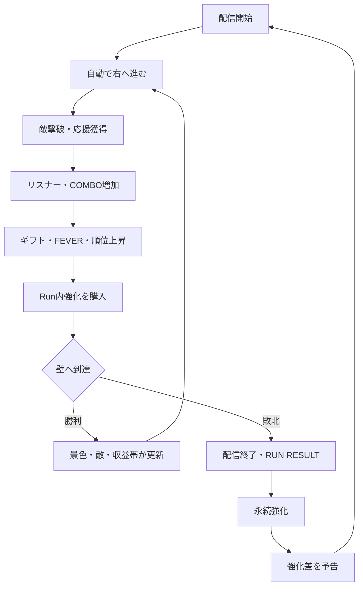
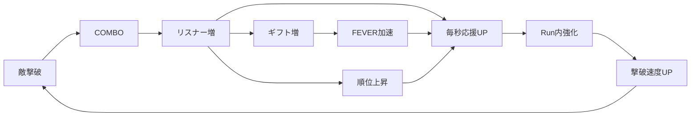
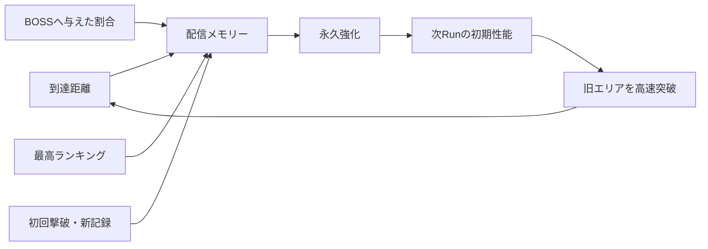

# 『八乙女さきやの ヤニ切れ大パニック！』

## Player Experience & Growth Flow v0.1

- Status: `CREATIVE DESIGN DRAFT / NOT YET ACCEPTED`
- Owner / Final Authority: さきや
- Primary responsibility: Player Experience
- Connected responsibility: Gameplay Systems
- Implementation status: `PAUSED UNTIL DESIGN ACCEPTANCE`

## 0. 情報の区分

### FIXED — さきや原案から守るもの

- 一本の長い世界を、ひたすら右へ進む。
- `AREA 1 → AREA 2 → AREA 3 → FINAL AREA → FINAL BOSS` を突破する。
- 中心ループは `進む → 稼ぐ → 負ける → 強化 → 再スタート → 前回より遠くへ進む`。
- 敗北は終了ではなく、次のRunが強くなる入口。
- 配信は装飾ではなく、リスナー、ギフト、FEVER、ランキング、収益、成長をつなぐシステム。
- 過去に苦戦した敵が、数Run後には瞬殺できる「俺つええ化」を必ず体感させる。
- Run、Result、Upgrade、Restart、Area Transition、Mid Boss、Area Boss、Final Boss、Fever、Save、Endingを成立させる。

### PROPOSAL — この文書で提案する設計

- 主人公は自動で右へ進み、通常攻撃も自動。プレイヤーは重要な瞬間へ介入する。
- 初回クリア目安は8〜12Run、合計30〜45分。
- 永続通貨の仮称を「配信メモリー」とする。
- 一度倒した旧AREA BOSSは再登場するが、演出を短縮し、成長後は高速で踏み越えられる。
- 永続強化は最初から8種を並べず、AREA突破に合わせて段階解放する。

### UNDECIDED — さきや判断が必要なもの

- 操作の濃さを「半自動アクション」にするか、より手動アクション寄りにするか。
- 初回クリアまでの標準プレイ時間。
- 永続通貨の正式名称。
- クリア後モードを初期完成範囲へ含めるか。

## 1. 体験の一文約束

> 前回は止められた場所を、次の配信では数字と歓声ごと踏み潰し、まだ見ぬ右側へ到達する。

このゲームで最も大事なのは「戦闘が上手くなること」だけではない。

プレイヤーが毎Run、次の三つを同時に感じられることを中心にする。

1. **自分で切り抜けた** — 回避、ゲージ管理、強化判断の成功。
2. **明らかに強くなった** — 前回の壁の高速撃破、桁、演出、移動速度の変化。
3. **まだ右に何かある** — 景色、敵、収益帯、配信の盛り上がりが更新される期待。

## 2. プレイヤー操作の役割

### 推奨する基本形：半自動アクション

通常移動と通常攻撃を自動化し、インクリメンタル成長の差を隠さない。一方で、放置しているだけでは壁を越えにくい設計にする。

| 入力 | 役割 | 成功時の気持ちよさ | 失敗時に失うもの |
| --- | --- | --- | --- |
| 回避 | 予告攻撃を避ける | ノーダメージ、COMBO継続、コメント反応 | HP、COMBO、リスナー増加速度 |
| イケボ発動 | 溜めたゲージで範囲攻撃／BOSS BREAK | 敵群消滅、大ダメージ、歓声 | 発動機会、次の危険への備え |
| ヤニ補給（長押し） | ヤニゲージを回復 | 継続火力を取り戻す | 補給中は攻撃・前進停止、被弾リスク |
| ギフト取得 | 飛来ギフトを拾う | 応援、回復、一時バフ、FEVER加速 | 取り逃し時は通常価値のみ自動回収 |
| Run内強化 | 応援を即座に投資 | その場で数字・速度・見た目が変わる | 別系統へ使う機会 |

### この形を推す理由

- 完全手動戦闘では、上達と永久成長のどちらで勝ったのか曖昧になる。
- 完全自動では、横スクロールアクションとしての緊張が薄い。
- 「通常は前へ進む」「危険と好機だけプレイヤーが握る」にすると、成長の快感と操作の成功を両立できる。

## 3. 一回のRunで起きる体験フロー

### Run中の三つの周期

1. **3〜8秒：戦闘周期**
   - 敵出現 → 自動攻撃 → 回避／イケボ → 撃破 → 数字とコメント。
2. **20〜40秒：配信盛り上がり周期**
   - COMBO → リスナー増 → ギフト波 → FEVER → ランキング上昇。
3. **60〜180秒：壁と突破の周期**
   - MID BOSS／AREA BOSS → 勝敗 → 新景色またはResult。

プレイヤーが何も判断しない時間を長くても8秒以内にする。

## 4. 初見からラスボス撃破までのPlayer Arc

| 段階 | プレイヤーの問い | 起きること | 感情の狙い |
| --- | --- | --- | --- |
| 最初の15秒 | 「何をすればいい？」 | 自動で右へ進み、最初の敵を数発で倒す。操作説明は状況に合わせて1つずつ出す | すぐ始まる、分かる |
| 15〜45秒 | 「何が増えている？」 | 応援、リスナー、毎秒収益、コメントが同じ撃破から連鎖 | 一つの行動が世界を騒がせる |
| 初FEVER | 「うわ、急に来た！」 | 画面密度、攻撃、ギフト、コメント、桁が一段上がる | 小さなクライマックス |
| 初MID BOSS | 「ここは操作が必要だ」 | 攻撃予告、回避、イケボの使いどころを学ぶ | 自分で越えた |
| 初敗北 | 「あと少しだった」 | AREA BOSSの残HPと今回の伸びを見せる | 終了より次の可能性 |
| 初強化 | 「次は数字が変わる」 | `12 → 31` のように開始時の差を購入前から見せる | 再挑戦の確信 |
| 2〜3Run目 | 「前の敵が弱い」 | 序盤敵を一撃、旧MID BOSSを高速撃破 | 俺つええ化の成立 |
| 初AREA突破 | 「本当に先があった」 | 背景、BGM、敵、数字帯を同時に切り替える | 旅が進んだ実感 |
| 中盤 | 「どの強化で壁を崩す？」 | 火力、継続、経済、FEVERの投資差が現れる | 自分の攻略方針 |
| AREA 3 | 「画面も数字も壊れてきた」 | K→M→B、ノイズ、雷、配信過熱 | 終盤の高揚と不穏 |
| FINAL BOSS | 「ここまで全部使う」 | 回避、補給、イケボ、FEVER、成長値を統合 | 長い旅の総決算 |
| 撃破後 | 「倒した」 | すぐ次画面へ飛ばさず、歓声と右端の景色を数秒残す | 勝利の余韻 |

## 5. 成長フロー

### 5.1 Run内の成長

#### Run内強化の4軸

| 軸 | 強くなるもの | 画面上の体感差 |
| --- | --- | --- |
| イケボ | 通常攻撃、イケボ技、BOSS BREAK | ダメージ桁、敵の吹き飛び、撃破音 |
| ヤニ吸引力 | 攻撃間隔、ヤニ容量、補給速度 | 攻撃の密度、止まらず戦える時間 |
| リスナーの愛 | 最大HP、回復、リスナー増加 | 耐久、LIVE人数の加速、応援の声 |
| 応援ボーナス | 敵収益、毎秒応援、ギフト価値 | 購入間隔が短くなる、ギフト波が派手になる |

Run内強化はRun終了時に失う。ただし、そのRunで「どこまで加速できたか」が永続通貨の獲得量へつながる。

### 5.2 Run間の永久成長

#### 失うもの／残るもの

| 状態 | Run終了時 | 理由 |
| --- | --- | --- |
| 応援（コイン） | リセット | Run内の加速を毎回作り直すため |
| Run内強化 | リセット | 同じ道の再攻略に変化を作るため |
| 現在リスナー／LIVE人数 | リセット | 新しい配信の立ち上がりを感じるため |
| ギフト数／FEVER | リセット | Runごとの盛り上がりを作るため |
| 配信メモリー（仮称） | 保持 | 永続成長の通貨 |
| 永続強化 | 保持 | 次Runの明確な体感差 |
| AREA解放／撃破記録 | 保持 | 冒険の履歴と達成証拠 |
| 最高到達点／最高順位／最高リスナー | 保持 | 過去の自分との比較 |

### 5.3 永続強化の段階解放

最初から8項目を見せず、成長に合わせて理解を増やす。これはVision縮小ではなく、情報の提示順を設計するもの。

| 解放時点 | 永続強化 | その時に理解してほしいこと |
| --- | --- | --- |
| 初敗北 | イケボ、ヤニ吸引力、リスナー定着率、ギフト倍率 | 火力／継続／経済の違い |
| AREA 1 BOSS初撃破 | FEVER効率、FEVER倍率 | 配信の盛り上がりを育てられる |
| AREA 2 BOSS初撃破 | ランキングボーナス、スタート支援金 | 古い区間をさらに高速化できる |

## 6. 配信システム同士の役割分担

### リスナー

- Run中の「観客の熱量」。撃破、回避、COMBO、BOSS、FEVERで増える。
- リスナー数は毎秒応援とギフト発生率を上げる。
- ただの数字ではなく、コメント密度、背景観客、歓声の強さも変える。

### LIVE人数

- 現在その瞬間に見ている人数。
- リスナー総数より揺れやすく、被弾や停滞で少し減る。
- プレイヤーに「今のプレイがウケているか」を即時に返す。

### ギフト

- 取得時に応援、回復、一時バフ、FEVERを与えるイベント。
- タップ取得で満額＋小ボーナス。取り逃しても一定割合は自動回収し、操作負担で損をさせすぎない。
- 大量ギフトはコメントと画面演出を同期させる。

### FEVER

- 敵撃破だけでなく、回避、COMBO、ギフト取得によって溜まる。
- MAXで自動発動する。発動を溜め込む最適解にはしない。
- 収益、攻撃、リスナー、ランキングを同時に加速させる「配信システムの合流点」。

### ランキング

- リスナーだけでなく、COMBO、BOSS撃破、ノーダメージ、FEVER中の成果を含む盛り上がりスコアから順位を算出。
- 順位上昇時は `#31 → #24` を明確に見せる。
- Run中の収益倍率に接続し、最高順位は次Run開始時の短い「注目枠ブースト」へ接続する。

## 7. 敗北から再挑戦までの感情設計

### 敗北直後

- `GAME OVER`は使わない。
- 戦闘画面を一瞬静止し、コメントが「次いける」「惜しい」へ変わる。
- `配信終了`の後、2秒以内にResultへ移る。

### Resultで最初に伝える三つ

1. **前回よりどこまで伸びたか** — 新記録、到達距離、前Runとの差。
2. **壁がどれだけ残ったか** — `BOSS HP 残り28%`。
3. **次に何が変わるか** — 推奨ではなく、購入候補ごとの具体的プレビュー。

例：

- 永久イケボLv.2へ：開始ダメージ `31 → 76`
- ヤニ吸引力Lv.1へ：補給時間 `2.4秒 → 1.8秒`
- 定着率Lv.1へ：最初の30秒の予想リスナー `8,200 → 13,500`

### 救済

- 同じBOSSへ与えたダメージ割合を永続通貨へ反映する「惜敗ボーナス」を設ける。
- 毎Run、最低1回は意味のある永続強化を購入できる量を保証する。
- 敵を裏で弱くする秘密の難易度調整は使わない。強くなった理由はプレイヤーの獲得と選択に置く。

## 8. 「強くなった」を数字以外で見せる契約

永続強化後は、最低でも三面で変化を返す。

1. **処理時間** — 同じ敵への撃破時間が大幅に短くなる。
2. **挙動** — オーバーキルで攻撃が隣の敵へ貫通し、前進速度が上がる。
3. **配信反応** — コメント、歓声、ギフト、ランキングの立ち上がりが早くなる。

### 旧BOSSの扱い

- 初遭遇時：登場演出、進行停止、専用HP、複数攻撃。
- 初撃破後：次Runでも登場するが、導入を短縮。
- 十分に成長後：数秒または一撃で倒せる。演出を止めず、`OVERKILL`とコメント爆発で通過する。

これにより「前に苦戦した敵が雑魚になった」を、記憶と現在の比較として成立させる。

## 9. AREAごとの体験役割

| 区間 | 教える／試すもの | 成長の証拠 | 突破時の更新 |
| --- | --- | --- | --- |
| AREA 1 | 回避、Run内強化、最初のFEVER | 通常敵の一撃化 | 初めて景色が大きく変わる |
| AREA 2 | 遠距離敵、ギフト取得、経済加速 | K帯への突入、購入頻度UP | FEVER永久強化解放 |
| AREA 3 | ヤニ補給の安全時間、長いBOSS戦 | M〜B帯、旧BOSS高速撃破 | 最終ライブ要塞の開放 |
| FINAL AREA | 全システムの統合 | 画面密度と桁の最大化 | FINAL BOSSとEnding |

## 10. バランス仮説 v0.1

### 推奨テンポ

- 1Run: 2分30秒〜5分。
- 初回クリア: 8〜12Run、合計30〜45分。
- 初Run: AREA 1 MID BOSSを倒し、AREA 1 BOSSを残HP40〜70%で敗北。
- 2〜3Run目: AREA 1突破。
- 3〜5Run目: AREA 2突破。
- 5〜8Run目: AREA 3突破。
- 8〜12Run目: FINAL BOSS撃破。

### 数値曲線の原則

- Run内強化は1Lvあたり約`×1.30〜1.45`。価格は約`×1.50〜1.70`。
- 主要な永続強化は序盤1Lvあたり約`×1.8〜2.5`。小さな`+5%`を主報酬にしない。
- 新しい大区間では要求値を約`×10〜15`へ跳ね上げ、桁が変わる感覚を作る。
- 初遭遇AREA BOSSの撃破時間は35〜60秒を想定。
- 適切な永続強化を1回挟んだ再戦は12〜25秒へ短縮。
- 二つ先の壁へ到達した頃、以前のAREA BOSSは3秒以内で倒せる。

数値は実装前の仮説。自動シミュレーションと実プレイで、Run回数、壁の残HP、強化購入数を計測して確定する。

## 11. FINAL BOSSとEnding

### FINAL BOSS

- 単なる高HPではなく、これまで学んだ三つを順番に要求する。
  1. 予告を見て回避する。
  2. 安全な瞬間にヤニ補給する。
  3. FEVERとイケボを重ねてBREAKする。
- 永続成長が不足していれば、上手くても長期戦で押し切られる。
- 十分な成長があれば、操作成功が最後の一押しになる。

### 撃破後

- 撃破直後にResultへ飛ばさない。
- 巨大装置停止、観客、コメント、最高LIVE人数を見せ、右端へ到達した余韻を残す。
- `配信終了`ではなく、初回だけ専用の締めを出す。
- 永続強化、記録、撃破状態は保持する。

## 12. 検証用シナリオ

### 必須PASS

- 初見プレイヤーが説明書なしで30秒以内に、前進、回避、強化、配信数値の関係を理解できる。
- 操作しなくても最初の楽しさは見えるが、放置だけでは最初の壁を越えにくい。
- 上手い操作による到達差は同成長値で15〜30%程度。永久成長を無意味にしない。
- 初敗北後、30秒以内に強化して再スタートできる。
- 毎敗北で、少なくとも一つの目に見える永続強化が可能。
- 同じ通常敵の撃破時間が、永久火力強化後に60%以上短縮する。
- 旧AREAの通過時間が、二つ先のAREA到達時には初回の半分以下になる。
- FEVER、ギフト、ランキングが別々の飾りではなく、収益と戦闘へ数値的に接続される。
- ラスボスまでの各Runを高速シミュレーションし、進行不能、資源枯渇、無限増殖がない。
- セーブ再読込後も、永続強化、解放、記録、撃破状態が一致する。

### 破綻条件

- Run内強化を触らなくても最適に進める。
- 強化後も序盤敵への体感差がない。
- 配信数値が増えるだけで、戦闘・収益・演出が変わらない。
- 旧AREAの消化時間が毎Runほぼ同じ。
- 敗北後に何を買えば何が変わるか分からない。
- ランキングの上昇条件が理解できず、順位がランダムに見える。
- ギフト取得操作が忙しさだけを増やす。
- FINAL BOSSが単なるHPの壁になる。

## 13. 次に確定するCreative Decision

最初に決めるのは、操作量とクリア尺。

### 操作量候補

1. **半自動アクション（推奨）**
   - 自動前進・自動通常攻撃。
   - 回避、イケボ、ヤニ補給、強化、ギフトへ介入。
2. **手動アクション寄り**
   - 移動または通常攻撃も手動。
   - プレイヤースキル差が大きくなり、インクリメンタル差が見えにくくなる可能性。
3. **インクリメンタル寄り**
   - 回避を簡略化し、強化判断を中心にする。
   - 操作の緊張が弱まりやすい。

### 初回クリア尺候補

1. **30〜45分／8〜12Run（推奨）** — Webゲームとして最後まで到達しやすく、成長段階も作れる。
2. **60〜90分／15〜22Run** — 育成の厚みが増えるが、AREA内の変化量がより必要。
3. **複数日／30Run以上** — 本格インクリメンタル。追加の成長層とクリア後運用が必要。

