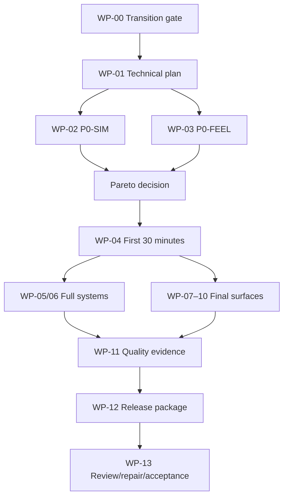

# MASTER FORGE HANDOFF

Status: WORK CREATIVE HANDOFF COMPLETE / SUGGESTED FORGE DECOMPOSITION / OWNER GATES OPEN  
Target repository: MICHIHAL/sakiya-game  
Creative source commit: 69b36a6ac59f1fad8157cb7ceb46ba352c476710  
Creative specification: docs/completion/00–14 plus registers at the commit that adopts this handoff  
Implementation authority: SAKIYA STUDIO Implementation Forge  
Final acceptance authority: SAKIYA

## 1. Handoff statement

Build the complete product described by `01_FINAL_PRODUCT_LOCK.md`. Do not reduce the full vision to P0 or an MVP. P0 and P1 are evidence gates that protect the complete vision before production expands.

Forge owns technical architecture, implementation, test code, CI, packaging, measurement, and technical tradeoffs. Forge does not own changes to the North Star, player role, personhood, activity identity, exact ENTRY CHIME invariant, 24+10 Major Event count, Semantic Retirement, Main Completion meaning, or Owner-only gates.

Current fact: the repository runtime is the superseded horizontal action / RUN game. No current-product build or current-product PASS evidence exists at the source commit. Legacy reports are not evidence for this handoff.

## 2. Mandatory source set

Read before proposal or implementation:

1. repository root instructions and current creative pointer;
2. `docs/work/WORK_PROMPT_COMPLETE_GAME_FORGE_HANDOFF_v1.2.md` and `docs/work/FORGE_EXECUTION_AUTHORITY_CONTRACT.md`;
3. `00_SOURCE_LEDGER_AND_TRANSITION.md`;
4. `01_FINAL_PRODUCT_LOCK.md`;
5. responsibility module `02`–`10` for the package being implemented;
6. `11_TEST_STRATEGY_AND_QUALITY_GATES.md`;
7. `12_ADVERSARIAL_REVIEW_PLAN.md`;
8. `13_ACCEPTANCE_EVIDENCE_MATRIX.md`;
9. `14_RELEASE_READINESS_GATE.md`;
10. `DECISION_REGISTER.md`, `EXPLORATION_REGISTER.md`, and `QUALITY_FINDING_LEDGER.md`.

Source conflict is returned, not silently resolved. Work Prompt v1.2 and the Authority Contract are the highest active operational contract. Both v1.1 prompts are lineage/non-conflicting Creative and Test-Intent detail only; the former version collision is closed. Root-pointer circularity remains an explicit transition issue rather than an excuse to replace this authority split.

## 3. Non-negotiable invariants

- North Star: 「一緒にデカくする。」
- Presence → Co-creation → Shared Expansion.
- Player is participant/translator, never manager, god, owner, or factory operator.
- Fictional people are not performance units, rarity, labor, sacrifice, or paid relationships.
- Zero-gift Main Progression and completion route.
- Broadcast is Before / LIVE / After; understood LIVE alone compresses.
- Streaming, video, singing, music, SNS, and live events retain distinct verbs/economies.
- Room remains the Activity Home.
- 24 Breakpoints + 10 Scale Peaks = 34 Major Events.
- Prestige and Scale Peak are distinct.
- Semantic Retirement stops old-unit live production and preserves proof/history.
- The first external fictional-person arrival invokes `ENTRY CHIME` once per save lineage; every accepted use resolves to the exact same source asset. Later-trigger policy is separate/test-dependent, and no variant is allowed.
- SP1 does not fire in P0.
- The complete first-launch-to-post-goal experience is playable on supported mobile hardware; portrait/touch is primary and a desktop-full/mobile-demo substitution fails.
- No architecture, coefficient, visual reference, public distribution, or unresolved decision is mislabeled as accepted.
- Creative PASS, Technical PASS, Sakiya Final Acceptance, Release-ready, and Public Release are separate.

### 3.1 Authority classification

- **Binding Creative:** product promise, North Star, role, complete player-visible experience, player-visible rules, activities, UI/audio/visual/content requirements, guardrails, and completion meaning.
- **Binding Test Intent:** what must be proven, what fails, required evidence categories, and Creative Review conditions.
- **Non-binding Engineering Recommendation:** implementation sequence, WPs, subagent composition, file ownership, parallelism, exact tests/IDs/framework, seeds, CI, architecture/internal models, technical adversarial-review timing/method, regression implementation, performance method, release engineering, and branch/commit method.

Suggested execution decomposition only. Implementation Forge may reorganize this work based on repository state, architecture, dependencies and risk.

Non-binding coordination reference: Work recommends an early checkpoint that exposes repository/legacy facts, architecture tradeoffs, dependency/risk relationships, ownership/coordination, test/evidence coverage, adversarial/regression coverage, and integration/rollback/return risks before irreversible expansion. Forge owns its timing, packet, graph, roster, plan structure, and return format. “Work did not specify the test” is not a valid reason to omit proof of a Binding Test Intent.

## 4. Suggested program sequence and canonical gates



The diagram is an advisory decomposition, not a mandated Engineering plan. Forge may reorder, merge, split, or rename packages after its repository-grounded plan, while preserving every Binding Creative and Test-Intent obligation. If retained, WP-11 test design starts after WP-01 and precedes each relevant implementation slice; its final evidence closes after WP-05–10. WP-07–10 are production responsibilities, not late polish.

Gate order:

| Gate | Required condition |
|---|---|
| Precondition — Source/Transition | direction, lineage, backup, save, prompt identity, and Owner migration gate are explicit |
| A — Creative Specification/Completion | adopted completion package has no unresolved internal blocker and preserves authority classification |
| B — P0 Validation | reproducible P0-SIM + P0-FEEL decision evidence; no SP1 firing; Creative recommendation and Owner gate stay separate |
| C1 — Integrated First 30 Minutes | integrated final-direction slice passes timing, comprehension, feel, and screenshot/listening review |
| C2 — Integrated Full Product | accepted activities, scale, content, beginning-to-post-goal journey, resilience, and final surfaces exist as one candidate on the full mobile artifact |
| D — Technical PASS | build, tests, performance, save, offline, recovery, device, and technical rights/privacy checks |
| E — Creative PASS | North Star, participation, personhood, distinct activities, scale meaning, tone, room/chime continuity |
| F — Sakiya Final Acceptance | explicit Owner acceptance of completion build and allowed waivers |
| G — Release-ready | deployable/store package, public assets, credits, privacy, licenses, rollback, known limitations |
| H — Public Release | separate explicit Owner authorization and action; never inferred |
| I — Post-release Verification | deployed-artifact smoke, access, save/update, copy/privacy/support and rollback monitoring evidence |

## 5. Common Work Package contract

Every Forge package return must preserve the following decision/evidence meanings so that PASS, waiver, failure, blockage, missing evidence, rollback, open decisions, and public-action truth cannot collapse into one status. This list is a replaceable reference interface: packet structure, exact vocabulary, field names, mappings, commands/metadata selection, and artifact-link format are Forge-owned.

- package ID and status: `PASS`, `PASS WITH OWNER-APPROVED WAIVER`, `FAIL`, `BLOCKED`, or `INSUFFICIENT EVIDENCE`;
- source and result commit SHAs; dirty-tree status;
- inputs and any conflict/assumption;
- architecture/implementation decision record owned by Forge;
- player-visible change list and non-goal confirmation;
- acceptance criteria mapped to test IDs;
- commands, environment, build ID, config, seeds, devices, and raw artifact links;
- defect/finding IDs and severities;
- repair commit(s) and regression result(s);
- rollback/recovery procedure and proof;
- unresolved UNKNOWN/Owner decisions without invented defaults;
- explicit statement that Public Release was or was not performed.

A summary without reproducible artifacts is `INSUFFICIENT EVIDENCE`.

## 6. WP-00 — Project Direction Transition

### Purpose

Create a recoverable, source-truth transition from the legacy RUN product to the creator-incremental product before replacing visible runtime behavior.

### Creative owner

SAKIYA for destructive/visibility decisions; Work module 00 for classification; Forge for migration mechanism.

### Dependencies

- Owner answer on legacy playable-runtime accessibility;
- adopted completion specification commit;
- verified source commit and hosted/source mapping.

### Inputs

`00`, root instructions/pointers, repository tree, legacy README/reports/build/save/assets, active Work prompt.

### Player-visible output

None required before Owner gate. After approval: current repository/docs point unambiguously to the new product while legacy source/save/runtime remain recoverable at the agreed surface.

### Non-goals

- do not implement the new game;
- do not decide architecture;
- do not delete/overwrite legacy source, old saves, or hosted runtime without Owner approval;
- do not call legacy PASS current evidence.

### Acceptance criteria

- unique active Work-contract revision/hash;
- circular source order normalized;
- KEEP/ADAPT/ARCHIVE/REMOVE/UNKNOWN map reviewed;
- backup/tag/branch/archive and exact rollback tested;
- legacy reports have superseded banners;
- new save namespace reserved; old save semantics isolated;
- hosted transition plan identifies source for both old and future versions;
- no destructive mutation precedes the Owner gate.

### Evidence

tree/commit inventory, source hashes, archive/rollback rehearsal, save inventory, hosted mapping, diff, Owner decision record.

### Rollback / recovery

Restore verified legacy commit/build and untouched old-save namespace; no broad destructive command; document reversibility before mutation.

### Forge return

`WP00_TRANSITION_RETURN` with exact operations proposed/performed, Owner authorization, resulting pointers, archived locations, and rollback proof.

## 7. WP-01 — Technical Audit & Forge Plan

### Purpose

Audit reusable capability and propose the architecture/production plan that can meet the full Product Lock.

### Creative owner

Work supplies player-visible constraints; Forge owns the technical proposal.

### Dependencies

- WP-00 read-only inventory;
- Owner-approved mutation boundary;
- Owner-accepted full-mobile Creative requirement; Forge compares installable web/PWA, native-store, shared-core/wrapper, or stronger repository-grounded alternatives. Commercial/public selection under ODG-09 may remain open during audit but blocks final distribution claims.

### Inputs

Current code, build, tests, save, audio, PWA/hosting, performance reports, assets, rights records, modules 01–14.

### Player-visible output

None; a credible plan for the complete mobile-first/offline-capable product and evidence pipeline.

### Non-goals

- do not treat existing React/Vite/worker architecture as automatically accepted;
- do not shrink scope to fit legacy code;
- do not select the Creative P0 A/B/C winner or invent SP1/SP7; Forge does own the technical mobile architecture recommendation;
- do not publish.

### Acceptance criteria

- keep/adapt/replace recommendation by subsystem with evidence;
- state/data, deterministic simulation, save/offline/update, large-number, UI, audio, content, accessibility, packaging, CI/test, performance, and observability plans;
- technical risks, spikes, estimates, sequencing, interfaces, and rollback boundaries;
- testability designed before feature implementation;
- current and legacy namespaces/artifacts cannot cross-contaminate;
- all creative Unknowns returned to their named gate.

### Evidence

reproducible clean build/test audit, dependency/license scan, bundle/runtime measurements, schema map, asset inventory, architecture decision records, risk register.

### Rollback / recovery

Audit is read-only; any spike is isolated and disposable.

### Forge return

`WP01_TECHNICAL_PLAN` plus package graph, test/evidence architecture, and explicit questions only where evidence cannot decide.

## 8. WP-02 — P0-SIM

### Purpose

Find non-dominated A/B/C economy candidates and expose timing, wait, churn, gift, positive-loop, and bottleneck failures before P0-FEEL selection.

### Creative owner

Work modules 03/04/11 define intent and gates; Forge owns model/test implementation.

### Dependencies

WP-01 deterministic simulation plan and approved P0 resource/event contract.

### Inputs

27 A×B×C configurations; bot/strategy set; milestones and thresholds; `EXPLORATION_REGISTER` EXP-001–004.

### Player-visible output

None required; candidates must nevertheless model the player-visible Broadcast→Video→Broadcast causality.

### Non-goals

- do not make P0 the final game;
- do not fire SP1;
- do not choose by one aggregate score;
- do not allow hidden-state oracle to represent normal play;
- do not use gifts as assumed progress.

### Acceptance criteria

- all 27 configurations run deterministically across justified seed coverage;
- streaming-first, video-first, balanced, high-frequency, pool-aware, video-minimal, Light, legal optimizer, separate oracle stress, person-churn, and zero-gift paired cases;
- P10/P50/P90/max milestone and loop distributions;
- P90 ≤70/manual loops between major BPs and max ≤80 target;
- >60s wait warning and >180s fail candidate, with no wait-only state;
- first revisit P50 5–8m/P90 ≤15m; regular P10 ≥8m/P50 12–15m/P90 ≤25m;
- first Video/Synergy P50 20–30m/P90 ≤45m;
- zero-gift route remains within accepted Main Progression budget;
- no person-churn or single activity consistently dominates;
- source, transformation, remainder, bottleneck transition, positive-loop convergence, and uncertainty reported;
- timing conflict reported as a decision, not hidden.

### Evidence

model source, config schema, deterministic seeds, raw outputs, plots/tables, uncertainty/stability method, Pareto frontier, failure traces, reproducible command.

### Rollback / recovery

Simulation is isolated from production saves and runtime. Rejected candidate code/config remains reproducible but cannot become default.

### Forge return

`WP02_P0_SIM_RETURN` with non-dominated candidates, rejected candidates/reasons, creative tradeoffs, and no final adoption claim.

## 9. WP-03 — P0-FEEL

### Purpose

Compare A1/A2/A3 as emotional participation using a shared short event sequence and final-direction audio/visual cues.

### Creative owner

Work module 02; Sakiya accepts the creative selection. Forge implements probes and captures evidence.

### Dependencies

WP-02 viable parameter ranges; final source candidate for ENTRY CHIME; test protocol/consent.

### Inputs

P0-FEEL 3–5 minute script: profile/skip, arrival, exact chime, silent stay, exit, history, revisit, first reaction, regularization precursor, After explanation.

### Player-visible output

Three matched probes differing only in permitted LIVE agency, with sufficient final-direction room/UI/audio quality to judge feel.

### Non-goals

- do not test final Scale or full content;
- do not optimize engagement by compulsory tapping;
- do not command Sakiya or author both sides;
- do not fire SP1;
- do not use a temporary chime to approve the invariant.

### Acceptance criteria

- same fictional person is recognized across arrival/exit/revisit;
- quiet person is not called weak/disposable;
- player role language is participation rather than control;
- event and cause survive ×1/×2 comparison;
- A2/A3 silence has no punishment; interaction remains ≤1–2 contextual actions per LIVE;
- CRITICAL precursors/causes are readable without showing a loot-like relation number;
- testers want another Broadcast without a gift;
- audio-disabled cue is equivalent;
- test limitations and sample size prevent false generalization.

### Evidence

build/commit, protocol, consent/anonymization, recordings, screen/audio capture, observation sheet, quotes/paraphrases within consent, coded outcomes, device/accessibility notes, comparative report.

### Rollback / recovery

Probes use isolated saves and fixture names. Discarded input modes remain branches/configs, never production defaults.

### Forge return

`WP03_P0_FEEL_RETURN` with candidate-specific failures and a joint P0-SIM/P0-FEEL Pareto input, not an automatic winner.

## 10. WP-04 — Integrated First 30 Minutes

### Purpose

Build a final-direction vertical experience that proves the chosen P0 contract can lead into the complete product.

### Creative owner

Work modules 01–10; accepted A/B/C decision; Sakiya reviews material creative changes.

### Dependencies

Gate B selection, current-product save namespace, accepted room/chime/visual direction, test plan before implementation.

### Inputs

Activity Home, optional participation profile, Broadcast loop, relationship continuity, BP1–3 meanings, Video Asset Idle bridge, first Synergy, responsive/accessibility/audio/content contracts.

### Player-visible output

A coherent first 30 minutes with final-quality direction, not a debug dashboard: first arrival/chime, revisit, cohort precursor, preserved material, first Video, Video-derived change, and BP1–3 transformation.

### Non-goals

- do not present this slice as the full product;
- do not make all activities shallow placeholders;
- do not include old RUN semantics;
- do not fake timings through developer grants;
- do not accept placeholder character/audio as final evidence.

### Acceptance criteria

- chosen A/B/C behaves within Pareto limits;
- player can explain Before/LIVE/After and Video return causality;
- BP1–3 each change play/production/decision rather than only numbers;
- first Video/Synergy distributions meet or explicitly reopen the timing gate;
- no wait-only, gift-required, person-churn, or Video-only dominant route;
- the full-product mobile portrait/touch artifact proves the complete early path; desktop may also be tested but cannot supply exclusive information or efficiency;
- keyboard/pointer/touch, reduced motion, no-audio cue, focus/readability, save/export/import, offline resume, and update message are represented;
- screenshot, motion, content repetition, and listening review use final-direction assets;
- all defects enter the Quality Finding Ledger and repairs receive regression.

### Evidence

clean build/test, session recordings, device screenshots, listening capture, timing distributions, interaction logs, save/offline/recovery proof, accessibility results, finding/repair/regression chain.

### Rollback / recovery

Feature flags/build channel isolate the slice; previous owner-only legacy runtime remains recoverable; save schema carries version/migration and export.

### Forge return

`WP04_FIRST30_RETURN` with Gate C1 status and any timing Change Audit proposal.

## 11. WP-05 — Core Product Systems

### Purpose

Implement the complete Broadcast, relationship, six-activity, bridge, economy, automation, save, and offline systems through the full progression.

### Creative owner

Work modules 02–04; Forge owns architecture and coefficients within accepted evidence.

### Dependencies

Gate C1; Forge-proposed operational Main Progression/bottleneck model reviewed against the visible multi-proof/no-bypass contract; test-intent coverage; versioned content/data schema.

### Inputs

Activity Bibles, bridge map, resource lifetime contract, Breakpoint interfaces, personhood, zero-gift, no-wait/dead-resource/dominance gates.

### Player-visible output

Streaming, Video, Singing, Music, SNS, and Live Event systems that feel and grow differently, connect through provenance-bearing bridges, and remain playable through acceleration/offline return.

### Non-goals

- do not make activities global bonus buttons;
- do not expose hidden relationship depth as a gacha score;
- do not consume people or relation;
- do not preserve dead counters for visual inflation;
- do not invisibly resolve important named-person events offline.

### Acceptance criteria

- each activity has distinct verbs, 2–4 primary resources/states, session/asset/meta roles, limiter, acceleration, return, and failure feedback;
- each activity begins from visible Sakiya intent/offer/boundary, keeps frame→transform→interpret phases, and lets the player explain Sakiya's intent separately from their contribution;
- all six complete activity loops, Bridges, Automation choices, failure/recovery, and Scale transformations are touch-operable on supported phones without desktop-only information, precision gestures, rapid tapping, or foreground-time coercion;
- removing an activity loses a unique judgment/cycle, not only a multiplier;
- provenance survives every bridge;
- Main Progression bottleneck visibly changes;
- automation follows understanding and reduces repetition without erasing firsts/important choices;
- zero-gift and multiple viable strategies pass long-run timing; strict Pareto, near-dominance, regret/opportunity-cost, route-use and sensitivity evidence do not reveal a de facto universal route;
- no resource survives without a choice, transformation, history, or retirement role;
- deterministic save/load, offline causality, clock manipulation resistance, migration, corruption recovery, and export/import round trip;
- large-number arithmetic/formatting remains correct across the complete range;
- complete input/accessibility/performance coverage exists.

### Evidence

system tests, economy simulations, activity probes, long-run/soak, save fixture matrix, offline/clock tests, number property tests, device recordings, content and UI captures, defect/regression records.

### Rollback / recovery

versioned migrations, backups, import validation before replacement, recovery UI, feature/package rollback, no downgrade corruption.

### Forge return

`WP05_CORE_SYSTEMS_RETURN` with activity-by-activity acceptance and unresolved balance decisions.

## 12. WP-06 — Prestige / Scale / World

### Purpose

Implement all accepted Major Events, Prestige/Scale logic, Semantic Retirement, room/world transformations, Main Completion, and post-goal.

### Creative owner

Work modules 01/02/05; Sakiya accepts BP/SP promotions and Main Completion.

### Dependencies

WP-05 full-system foundation; Owner/test resolution for relevant HYPOTHESIS slots; scale test harness.

### Inputs

U0–U10 ontology; BP1–24 map; SP1–10 contracts; Prestige loss/preservation; retirement receipts; room/audio/activity continuity; completion proposal.

### Player-visible output

Ten semantic changes of measurement and twenty-four play-changing Breakpoints, with accelerating recovery, distinct world problems, preserved people/works/room, and a coherent end/post-goal.

### Non-goals

- do not convert HYPOTHESIS thresholds to Canon without evidence;
- do not fire SP1 in P0 evidence;
- do not treat Prestige as Scale;
- do not keep retired live production hidden;
- do not use praise-only worldbuilding or an abstract dashboard replacement;
- do not create automatic U11.

### Acceptance criteria

- exactly 24 BP and 10 SP identities exist and are test-addressable;
- each accepted BP changes production, transformation, choice, or play;
- each SP proves old-unit inadequacy, new-unit production/consumption/decision, continuity, and retirement;
- adjacent BP/SP events have separate triggers, Moments, decisions/results, receipts and recall, with an intervening new judgment and distinct old-Unit-insufficiency proof;
- SP1 probes are limited to post-individual-event stream-level judgment changes with independent trigger/Moment/decision/receipt/old-Unit-insufficiency proof; first arrival/ENTRY CHIME and BP1 are anti-candidates, and production Canon requires Creative Review recommendation and SAKIYA acceptance through ODG-05;
- SP7 meets its structural gate before Forge proposes a technical threshold; Creative Review checks visible meaning and SAKIYA accepts any player-visible Canon through ODG-06;
- Prestige lists loss/preservation and creates a new judgment; people/history/representative works/room persist;
- retired-unit generation is zero; final value/basis remain inspectable;
- room, exact chime, audio, activities, and named history recur at every layer;
- tone failures include resistance, logistics, mismatch, and unintended consequences—not universal praise;
- representative activity and late-Scale choices preserve visible Sakiya intent/boundary and a separately explainable player contribution;
- U10 demonstrates at least two bounded, provenance-bearing propagation configurations with a distinct source/use/bottleneck/decision and no retired-unit regrowth or universal activity;
- representative BP/SP plus stable U10, Main Completion, Continue, and Strong New Game are readable and operable on the full mobile artifact, including interruption/recovery;
- completion and both post-goal modes preserve the proposed contract;
- long-run timing, recovery, strategy diversity, HUD retirement, save, and performance pass.

### Evidence

BP/SP test matrix, event recordings, before/after saves, retirement receipts, unit-explanation human tests, long-run simulation, screenshots/listening, completion/Continue/Strong NG recordings, Owner decision record.

### Rollback / recovery

pre-Prestige/SP save snapshot, idempotent migration, recovery from interrupted transition, receipt-based state reconstruction, no person/history loss.

### Forge return

`WP06_SCALE_RETURN` with Major Event status map and separate Technical/Creative/Owner gate results.

## 13. WP-07 — UI / Visual / Motion

### Purpose

Produce the complete screen system and final visual/motion language across U0–U10 with mobile portrait/touch as the primary full-product surface. Delivery/entitlement architecture is Forge-owned, but mobile completeness is not optional.

### Creative owner

Work module 06; Sakiya approves canonical visual reference and final material direction.

### Dependencies

WP-04 information needs; WP-05/06 state contracts; Owner visual reference/rights gate.

### Inputs

UI-00–20 inventory, hierarchy, responsive rules, room/world intrusion, motion tiers, states/assets, screenshot acceptance.

### Player-visible output

Final-quality Activity Home, Broadcast, activity, progression, history, save/settings/accessibility, transition, completion, and error/empty states with coherent responsive behavior.

### Non-goals

- do not choose Sakiya depiction without Owner approval;
- do not hide domain differences under a generic dashboard;
- do not push accessibility/error states to later polish;
- do not accept placeholder geometry or text-only cosmic scale as final.

### Acceptance criteria

- all screens/states have entry/exit, empty/loading/error/offline/update/focus behavior;
- Activity Home and primary intent remain readable at every scale;
- supported phone portrait/landscape and every other claimed surface avoid hidden controls/overlap; all activities, history, comparison, BP/SP, completion and post-goal states are present on full mobile;
- target sizes, focus, text scaling, contrast, reduced motion, and no-color-only cues pass;
- motion communicates consequence and priority without blocking input or causing fatigue;
- room and chime visual cue remain consistent;
- accepted screenshot set covers first 5m/30m, each Macro Layer, Prestige, SP, Main Completion, post-goal, errors, and accessibility variants;
- visual assets have provenance and no final placeholders/TODO/dead controls.

### Evidence

real-device screenshots/video, viewport matrix, visual regression baselines, interaction/focus recordings, accessibility audit, asset/provenance manifest, Owner reference approval.

### Rollback / recovery

versioned visual tokens/assets and baselines; asset fallback must be intentional and accessible, never a hidden placeholder.

### Forge return

`WP07_UI_VISUAL_RETURN` with screen-state coverage and screenshot-level Creative Review.

## 14. WP-08 — Audio / Music / SFX

### Purpose

Produce, integrate, mix, and verify the complete audio curve while preserving the exact arrival invariant.

### Creative owner

Work module 07; Sakiya approves final ENTRY CHIME source and final listening acceptance.

### Dependencies

accepted room/scale/activity event map; rights/provenance; final device targets.

### Inputs

music map, six activity suites, Prestige/Scale/completion stingers, SFX hierarchy, quiet moments, audio-accessibility contract.

### Player-visible output

Finished room/activity/scale music, SFX, mixes, ducking, transitions, mute/no-audio equivalence, and exact recurring ENTRY CHIME.

### Non-goals

- do not vary the chime by pitch, remix, layer, luxury, or finale;
- do not make audio the only carrier of information;
- do not let late-scale music erase room/person events;
- do not count temporary/generic library tracks as final without approval/rights.

### Acceptance criteria

- unchanged packaged/runtime identity of every chime playback is the accepted asset, proven by a Forge-selected mechanism;
- visual/caption cue occurs at the same event;
- activity suites are distinguishable without genre stereotypes replacing function;
- Scale curve expands while preserving quiet/room memory;
- SFX priority, ducking, cooldown, loudness, clipping, mono/small-speaker/headphone behavior pass;
- full-product phone speaker/headphone/Bluetooth as supported, mute/silent, audio-unlock denial, call/alarm, route change, background/resume, volume/device change and low-power states are safe;
- all assets have license/provenance and credit mapping;
- listening QA covers firsts, long sessions, each layer, Prestige/SP, completion, reduced/muted use.

### Evidence

packaged/runtime identity proof (hashes are one reference option), source sessions/masters, cue-event evidence, mix/listening evidence, rights coverage, and regression proof; exact artifacts and methods are Forge-owned.

### Rollback / recovery

versioned masters/cues/mix config; invalid audio cannot corrupt save or block interaction; retain accepted chime source independently.

### Forge return

`WP08_AUDIO_RETURN` with listening status, exact-chime invariant proof, and rights status.

## 15. WP-09 — Content / Flavor

### Purpose

Author, integrate, and quality-control the complete human-selected content pool across early intimacy, activity specificity, scale absurdity, ending, and credits.

### Creative owner

Work module 08; Sakiya controls Sakiya-authored/approved voice.

### Dependencies

accepted activity/world event schema; content tooling; provenance/status fields; localization/display limits.

### Inputs

source HYPOTHESIS candidates 919/1,200 authored units and 698/712 first-play exposures; separate Package/Payload/Exposure definitions; layer/activity/state coverage; voice separation.

### Player-visible output

Varied participant/session/activity/room/BP/SP/world/ending/credits text whose humor and specificity evolve with the game.

### Non-goals

- do not simulate or quote real listeners by default;
- do not label Work/system text as Sakiya-authored;
- do not fill quotas with generic AI variants;
- do not use people as punchlines or universal praise.

### Acceptance criteria

- inventory meets category/layer/state coverage with stable IDs/status/provenance;
- adopted Package/Payload/Exposure counts are reconciled top-down and bottom-up, with the 698/712 and 919/1,200 changes explicitly audited rather than silently selected;
- first 30m, each layer, each activity, all BP/SP, failure/empty/offline/update, ending/credits have coverage;
- repetition/fatigue/missing-text/truncation/unsafe-token tests pass on phone portrait and large text; no desktop tooltip/table carries unique meaning;
- content preserves personhood, activity specificity, dry scale humor, and room continuity;
- generated assistance is disclosed and every included item is human-selected/context-assigned/reviewed;
- credits map authorship/licenses accurately.

### Evidence

queryable inventory, counts, coverage result, reproducible exposure runs, repetition analysis plus human review, screen evidence, editorial/provenance trace, and credits preview. Names, schemas, tools, and capture decomposition are replaceable Forge choices; the listed meanings and verdict coverage are binding.

### Rollback / recovery

versioned content bundles and IDs; missing/invalid bundle falls back to safe reviewed copy without losing save references.

### Forge return

`WP09_CONTENT_RETURN` with coverage/repetition/authorship status and rejected-content record.

## 16. WP-10 — Accessibility / Input / Platform

### Purpose

Make the complete experience usable across supported inputs, viewports, assistive preferences, offline/update states, and real target devices.

### Creative owner

Work module 09 defines experience; Forge owns platform implementation; Sakiya owns shipping target decision.

### Dependencies

WP-01 platform plan; WP-04 interface; WP-05 saves/offline; WP-07/08 final surfaces.

### Inputs

input matrix, 44×44 primary target, reading/timing, reduced motion, contrast/text/number/audio alternatives, save/offline/update UX, real-device list.

### Player-visible output

The full product is validated on supported mobile hardware from first launch through Main Completion, Continue, and Strong New Game. Portrait/touch is primary; landscape, interruption/background-resume, storage pressure, thermal/memory limits, audio unlock, safe save/offline/update and entitlement/recovery states are first-class. Desktop and optional demo surfaces are additional claims, never substitutes.

### Non-goals

- do not substitute a bounded demo, emulator, desktop run, or reduced control scheme for full mobile evidence;
- do not require hover, sound, color, precision drag, or rapid tapping;
- do not claim platform support from emulation alone;
- do not require continuous network for ordinary play after a valid install/entitlement unless SAKIYA explicitly accepts that visible promise and its recovery/privacy cost.

### Acceptance criteria

- complete first-launch-to-post-goal critical path by touch on the full mobile artifact; keyboard/pointer parity applies where those inputs are claimed;
- logical focus order, visible focus, no trap, reflow/text scaling, contrast, target sizes, screen-reader naming/status announcement;
- reduced motion removes nonessential travel/zoom/shake without hiding consequence;
- captions/visual cue cover all informational audio including chime;
- pause/log/review make timed information recoverable;
- save/export/import/recovery/offline/update behavior is understandable and non-destructive;
- named current and lower-bound supported iPhone/Android real-device matrix passes portrait/landscape, safe area, virtual keyboard, call/lock/app-switch/background/termination resume, thermal/memory, low-power, autoplay/audio unlock, storage/eviction, offline/update, install/package and entitlement behavior;
- limitations are explicit and drive final platform decision.

### Evidence

manual assistive/device scripts, automated audit where useful, recordings/screenshots, focus/semantic tree, storage/offline/update traces, issue/regression results.

### Rollback / recovery

safe-mode settings, reset accessibility preferences without save loss, update rollback and export path, unsupported-version message.

### Forge return

`WP10_ACCESS_PLATFORM_RETURN` with device-by-device status and shipping recommendation.

## 17. WP-11 — Quality / Balance / Performance

### Purpose

Define tests before implementation, continuously verify all completion layers, and produce the evidence required for Technical and Creative review.

### Creative owner

Work modules 11–14 define visible acceptance; Forge owns test design/execution; independent Critics own adversarial findings.

### Dependencies

Starts after WP-01; gates every later WP.

### Inputs

Binding coverage T0–T11 from document 11, Evidence Matrix, defect severity, quality ratchet, and supported device/build obligations. Exact catalog IDs, cases, thresholds, tools, and matrix implementation are Forge-owned.

### Player-visible output

No separate feature; a stable, comprehensible, resilient complete game whose claimed behavior is reproducible.

### Non-goals

- do not optimize only Q1 functional correctness;
- do not substitute a single build success for quality;
- do not reuse legacy PASS;
- do not close a finding without repair and regression evidence;
- do not hide BLOCKER/HIGH behind an average score.

### Acceptance criteria

- test intent precedes implementation for each package;
- source/direction, unit/property, integration, P0, economy, activity, scale, UI/visual, audio, accessibility, save/offline/recovery, performance/soak, content/rights, completion/release tests execute at correct phase;
- economy includes seeds, P10/P50/P90/max, zero-gift, person-gacha, no-dead-resource, no-single-strategy, no-wait, positive-loop, large-number tests;
- save includes corruption, migration, export/import round trip, interruption, crash recovery, clock manipulation;
- performance includes startup/load, frame pacing, memory growth/leak, long idle/active, background/resume, low-end device;
- visual/audio/accessibility/content baselines are quality-ratchet regression assets;
- every repair cites finding → commit → focused test → broader regression → re-review;
- Evidence Pack is immutable or hash-addressed and traceable to source/result commits.

### Evidence

CI/manual reports, raw simulations, test fixtures, device/soak logs, screenshots/recordings, listening sheets, coverage matrix, finding ledger, repair/regression chain.

### Rollback / recovery

failed candidate/build cannot replace last accepted evidence build; reproducible artifact retention and save-compatible rollback.

### Forge return

`WP11_QUALITY_RETURN` with test layer status, gaps, flake/quarantine policy, findings, and Technical PASS recommendation or refusal.

## 18. WP-12 — Release Preparation

### Purpose

Prepare, but do not publicly release, the accepted build and all public-facing, legal, recovery, and distribution artifacts.

### Creative owner

Work modules 09/10/14; Forge packages; Sakiya decides commercial surface and later authorizes release.

### Dependencies

WP-05–11 candidate passes; rights/privacy/business decisions; platform/store selection.

### Inputs

production build, save/update plan, store/public copy, screenshots/trailer if required, icons, privacy notice, credits/licenses, price/store data, support/rollback plan.

### Player-visible output

A distributable candidate and honest public package whose claims match the verified product.

### Non-goals

- do not press publish or expose a public URL/listing;
- do not claim unsupported platforms/features;
- do not omit generated/licensed contribution or known limitation;
- do not overwrite the only recoverable prior version.

### Acceptance criteria

- reproducible production build and install/launch/update/uninstall where applicable;
- signed/notarized/store checks where required by chosen channel;
- correct title/identity/icons/screenshots/description/release notes;
- privacy, consent/withdrawal (if ever applicable), licenses, credits, asset provenance complete;
- price/store economics and creative friction accepted by Owner;
- support, crash/save recovery, rollback, incident stop, and takedown procedures rehearsed;
- public claims trace to evidence and Known Limitations;
- final package hash and private delivery surface recorded.

### Evidence

build recipe/hash, clean-machine/device install recordings, store validator output, rights/privacy/credits checklist, public-copy fact check, rollback drill, package inventory.

### Rollback / recovery

retain last accepted build, source, data schema, store/public assets, and tested rollback; define stop-release triggers.

### Forge return

`WP12_RELEASE_PREP_RETURN` with `PUBLIC_RELEASE_PERFORMED: false` unless a separate explicit authorization exists.

## 19. WP-13 — Final Acceptance & Polish Loop

### Purpose

Run independent adversarial review, repair every actionable defect, regress, re-review, close gates, and request Sakiya Final Acceptance.

### Creative owner

Independent Critics are read-only; responsible Forge/Creative owners repair; Sakiya accepts or rejects final build/waivers.

### Dependencies

Release candidate plus complete WP-11/12 Evidence Pack.

### Inputs

Full build, modules/registers, prior evidence, Quality Finding Ledger, review lenses in 12, device/accessibility/audio/content/rights package.

### Player-visible output

The complete, polished, from-first-minute-through-post-goal product with no placeholders/TODO/dead controls and an evidence-backed known-limitations state.

### Non-goals

- Critics do not implement fixes or soften Canon;
- no review-by-summary only;
- no closure by assertion;
- no Public Release without a later explicit Owner action.

### Acceptance criteria

- fresh Critics review Creator Fidelity/Personhood, systems/balance/scale, interface/visual/audio/content/accessibility, resilience/release trust, and handoff/source integrity;
- each finding has evidence pointer, violated criterion, severity, owner, repair condition, regression scope, and status;
- BLOCKER = 0;
- HIGH = 0 unless a precise Owner waiver records impact, evidence, expiry/revisit, and affected claims;
- remaining MEDIUM appear as Known Limitations with accepted effect; LOW aggregated for cheapness/polish trends;
- all repaired findings have repair commit, focused retest, broader regression, and independent re-review;
- real-device complete-path and external test evidence exists;
- placeholder/TODO/dead control/missing text/license gap = 0;
- Technical PASS and Creative PASS are separately signed/recommended;
- Sakiya explicitly accepts Main Completion/build and any waiver;
- Release-ready Gate G is complete; Public Release Gate H remains separate.

### Evidence

critic reports, finding ledger, repair commits/diffs, test/regression runs, final real-device recordings/screenshots, audio review, long-play/soak, rights/privacy/build/rollback, Owner acceptance.

### Rollback / recovery

Every polish change remains revertible to the last accepted candidate; save compatibility is regression-gated; failed repair reopens the finding.

### Forge return

`WP13_FINAL_RETURN` containing Gate D–G status, Gate H authorization/action status, Gate I plan/status, signatures/recommendations, Owner decision request, Known Limitations, and explicit release prohibition/status.

## 20. Binding test-intent coverage

These coverage families align with document 11. Their creative question, failure meaning, and evidence category are binding; the family labels, exact cases, scenarios, thresholds, tools, seeds, frameworks, and capture method are non-binding Engineering Recommendations that Forge may replace with traceable equivalents.

| Coverage | Binding intent |
|---|---|
| T0 — Direction | source/authority, current-vs-legacy boundary, status-label integrity, and no false completion/release claim |
| T1 — P0-SIM | multi-proof progression, 27-candidate comparison intent, resource lifetimes, wait/loop safety, zero gift, personhood, dominance and near-dominance |
| T2 — P0-FEEL | emotional participation, Sakiya/player Shared Agency, person/event recall, Broadcast feel, chime identity/trigger fatigue, Pareto Creative recommendation |
| T3 — First 30 Minutes | integrated BP1–3/video/first-synergy meaning, timing evidence, comprehension, recovery, and room/visual/audio continuity |
| T4 — Long Journey | 2h/10h/midgame/Main/post-goal economy on mobile, six distinct activities, Automation, 24 BP/10 SP, Prestige, Semantic Retirement, stable U10, completion and continued reasons to play; paired zero-gift reachability through every SP/Main Completion and full-arc no-wait/dead-resource/person-churn/near-dominance regression |
| T5 — UI/Visual/Motion | complete mobile-first screen/state/navigation/responsive scope, person-first hierarchy, room continuity, scale legibility, interruption and reduced-motion equivalence; no desktop-only information or strategy |
| T6 — Audio | exact ENTRY CHIME asset identity, Binding first-lineage arrival trigger, separately approved later-trigger policy, activity/scale audio differentiation, fatigue, mute/no-audio equivalence and rights |
| T7 — Save/Offline/Update | local-first mobile lifecycle persistence, retirement freeze, migration/import/export, background/termination/corruption/clock/crash/update recovery and rollback |
| T8 — Input/Accessibility/Device | touch-first complete path, applicable keyboard/pointer, focus/semantics, readable scale/numbers/time, contrast, captions, targets, current/lower-bound real mobile devices and entitlement-bound surface truth |
| T9 — Performance/Soak | mobile startup/load/frame/memory/thermal/battery/background/long-session/offline-return behavior without event, state, causality, or accessibility loss |
| T10 — Content | defined authored/exposure units, coverage, repetition/fatigue, missing/dead text, tone/agency/personhood, localization and provenance |
| T11 — Trust/Release | rights, privacy, entitlement, packaging, credits, rollback, public-copy truth, release authorization and post-release verification |

Exact executable mapping is Forge-owned. A Binding Test Intent reported as `NOT RUN` or `INSUFFICIENT EVIDENCE` cannot satisfy its gate.

## 21. Defect and waiver rules

| Severity | Meaning | Gate rule |
|---|---|---|
| BLOCKER | unusable, destructive, unreachable completion, major rights/privacy, North Star/personhood destruction, unpublishable | zero; no implicit waiver |
| HIGH | major system/UI/audio/accessibility/economy/long-run failure | zero by default; only explicit Owner waiver with impact/evidence/revisit |
| MEDIUM | localized confusion, repetition, or polish deficit | may remain only as accepted Known Limitation |
| LOW | minor visual/text/preference defect | track in aggregate; cheapness trend can elevate severity |

Any change to an accepted timing, screenshot, audio behavior, save behavior, accessibility behavior, invariant, or Major Event reopens its regression scope and receives a Change Audit.

## 22. Stop conditions

Forge stops and returns `BLOCKED` rather than expanding authority when:

- a creative source conflict changes player experience;
- destructive legacy migration lacks Owner approval;
- canonical visual, final chime, asset license, real-person consent, store/commercial, or release decision is missing;
- P0 candidates are dominated but the requested direction requires adoption;
- a safe save migration/rollback cannot be proven;
- a BLOCKER/HIGH would be hidden by continuing;
- a public action is requested only by implication;
- required evidence cannot be generated or reproduced.

## 23. Completion return envelope — replaceable reference

The final Forge return must preserve separate, inspectable truth for source/result identity, every Gate, findings, waivers, unknowns, Owner decisions, Evidence, rollback, limitations, and whether Public Release occurred. Serialization, field names, exact status tokens, file count, and human/machine interfaces are Forge-owned. The YAML below is an illustrative reference, not a required envelope:

```yaml
handoff: SAKIYA_CREATOR_INCREMENTAL_COMPLETE_PRODUCT
source_commit: <sha>
result_commit: <sha>
build_id: <id>
public_release_performed: false
gates:
  source_transition: PASS|FAIL|BLOCKED|INSUFFICIENT_EVIDENCE
  creative_specification: PASS|FAIL|BLOCKED|INSUFFICIENT_EVIDENCE
  p0_selection: PASS|FAIL|BLOCKED|INSUFFICIENT_EVIDENCE
  first_30_minutes: PASS|FAIL|BLOCKED|INSUFFICIENT_EVIDENCE
  integrated_full_product: PASS|FAIL|BLOCKED|INSUFFICIENT_EVIDENCE
  technical_pass: PASS|FAIL|BLOCKED|INSUFFICIENT_EVIDENCE
  creative_pass: PASS|FAIL|BLOCKED|INSUFFICIENT_EVIDENCE
  sakiya_final_acceptance: PASS|PENDING|REJECTED
  release_ready: PASS|FAIL|BLOCKED|INSUFFICIENT_EVIDENCE
  public_release: NOT_AUTHORIZED|AUTHORIZED_NOT_RUN|RUN
  post_release_verification: NOT_APPLICABLE|PENDING|PASS|FAIL|BLOCKED|INSUFFICIENT_EVIDENCE
findings:
  blocker_open: <integer>
  high_open: <integer>
  medium_open: <integer>
  low_open: <integer>
waivers: []
unknowns: []
owner_decisions_pending: []
evidence_index: <path-or-uri>
rollback_proof: <path-or-uri>
known_limitations: []
```

## 24. Final truth condition

This handoff is ready to enter Forge when the completion documents are adopted and the initial Owner transition gates are answered. It is not evidence that implementation, Creative PASS, Technical PASS, Release-ready, or Public Release has occurred.

The product is complete only when the full UI, audio, beginning-to-post-goal experience, distinct activity economies, semantic world escalation, save/offline/accessibility resilience, rights/public package, adversarial repair, regression, real-device evidence, and Sakiya Final Acceptance all close. A foundation, partial playable, successful build, or one passing test run is not completion.

## 25. FORGE EXECUTION AUTHORITY

Suggested execution decomposition only. Implementation Forge may reorganize this work based on repository state, architecture, dependencies and risk.

Forge owns technical architecture, implementation plan, work breakdown, actual subagent composition and coordination, executable test strategy/cases/simulation, technical adversarial review, regression implementation, CI, performance engineering, release engineering, and branch/commit plan. The WP-00–WP-13 decomposition, sequence diagram, exact test-family labels, evidence-capture mechanics, and proposed return packet are advisory interfaces, not mandated Engineering architecture.

Work owns the finished-game Creative Intent: product promise, player role, complete player-visible experience, player-visible rules, invariants, activity/world/UI/audio/visual/content requirements, completion meaning, failure intent, Creative Review conditions, and evidence categories. SAKIYA retains final creative and release authority.

Non-binding coordination checkpoint reference: Work recommends that Forge expose material repository/architecture/evidence conflicts early enough to prevent irreversible expansion. Forge owns checkpoint timing, packet, work breakdown, graph, roster, and return format. A useful early return may cover:

1. repository/current-vs-legacy audit;
2. architecture alternatives and tradeoffs;
3. dependency/risk relationships in a Forge-selected representation;
4. actual ownership/coordination approach where useful;
5. executable test and evidence strategy covering every Binding Test Intent;
6. technical adversarial-review and regression strategy;
7. commit, integration, rollback, and return plan.

Forge may strengthen, merge, split, reorder, or replace any Engineering recommendation with traceable evidence. Forge must return to SAKIYA STUDIO before changing Creative Intent, an invariant, a player-visible rule, an accepted completion meaning, or an Owner gate. “Work did not specify the test” is not a valid basis for leaving a Binding Test Intent unproven.
